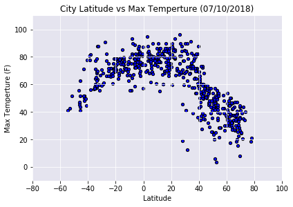
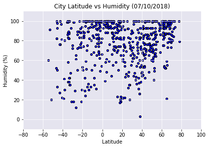
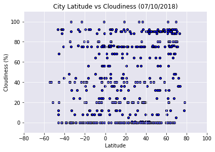
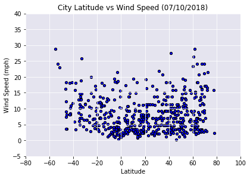

## WetherPy
---

#### Analysis

* Observer Trend 1
* Observer Trend 2
* Observer Trend 3


```python
# pip install citipy
```


```python
# Dependencies and Setup
import matplotlib.pyplot as plt
import pandas as pd
import numpy as np
import requests
import time

# Import API key
from secure.api import api_keys

# Incorporated citipy to determine city based on latitude and longitude
from citipy import citipy

# Output File (CSV)
output_data_file = "./output_data/cities.csv"

# Range of latitudes and longitudes
lat_range = (-90, 90)
lng_range = (-180, 180)
```

## Generate Cities List


```python
# List for holding lat_lngs and cities
lat_lngs = []
cities = []

# Create a set of random lat and lng combinations
lats = np.random.uniform(low=-90.000, high=90.000, size=1500)
lngs = np.random.uniform(low=-180.000, high=180.000, size=1500)
lat_lngs = zip(lats, lngs)

# Identify nearest city for each lat, lng combination
for lat_lng in lat_lngs:
    city = citipy.nearest_city(lat_lng[0], lat_lng[1]).city_name
    
    # If the city is unique, then add it to a our cities list
    if city not in cities:
        cities.append(city)

# Print the city count to confirm sufficient count
len(cities)
```


    624


## Perform API Calls


```python
def getjsonRow(cityJSON):
    return {
        "City": cityJSON["name"],
        "Cloudyness": cityJSON["clouds"]["all"],
        "Country": cityJSON["sys"]["country"],
        "Date": cityJSON["dt"],
        "Humidity": cityJSON["main"]["humidity"],
        "Lat": cityJSON["coord"]["lat"], 
        "Lng": cityJSON["coord"]["lon"],
        "Max Temp": cityJSON["main"]["temp_max"],
        "Wind Speed": cityJSON["wind"]["speed"]
    }

```


```python
# OpenWeatherMap API Key
api_key = api_keys

# Starting URL for Weather Map API Call
url = "http://api.openweathermap.org/data/2.5/weather?units=Imperial&APPID=" + api_key 

i = 1
j = 1
city_dic = []

print('Begining Data Retrival')
print('----------------------')

for city in cities:

    print(f'Processing Record {i} of set {j} | {city}')
    print(url + '&q={}'.format(city))
    
    response = requests.get(url + '&q={}'.format(city))
    
    if response.json()["cod"] == 200:
        city_dic.append(getjsonRow(response.json()))

    i = i + 1

    if i >= 51:
        i = 0
        j = j + 1
        time.sleep(20)

print('----------------------')
print('Data Retrival Complete')
print('----------------------')
```

    Begining Data Retrival
    ----------------------
    Processing Record 1 of set 1 | barrow
    http://api.openweathermap.org/data/2.5/weather?units=Imperial&APPID=e4c4a7418202ae1808edaff758ac1d7d&q=barrow
    Processing Record 2 of set 1 | layou
    http://api.openweathermap.org/data/2.5/weather?units=Imperial&APPID=e4c4a7418202ae1808edaff758ac1d7d&q=layou
    Processing Record 3 of set 1 | chuy
    http://api.openweathermap.org/data/2.5/weather?units=Imperial&APPID=e4c4a7418202ae1808edaff758ac1d7d&q=chuy
    Processing Record 4 of set 1 | rikitea
    http://api.openweathermap.org/data/2.5/weather?units=Imperial&APPID=e4c4a7418202ae1808edaff758ac1d7d&q=rikitea
    Processing Record 5 of set 1 | batemans bay
    http://api.openweathermap.org/data/2.5/weather?units=Imperial&APPID=e4c4a7418202ae1808edaff758ac1d7d&q=batemans bay
    Processing Record 6 of set 1 | hermanus
    http://api.openweathermap.org/data/2.5/weather?units=Imperial&APPID=e4c4a7418202ae1808edaff758ac1d7d&q=hermanus
    Processing Record 7 of set 1 | severo-kurilsk
    http://api.openweathermap.org/data/2.5/weather?units=Imperial&APPID=e4c4a7418202ae1808edaff758ac1d7d&q=severo-kurilsk
    Processing Record 8 of set 1 | albany
    http://api.openweathermap.org/data/2.5/weather?units=Imperial&APPID=e4c4a7418202ae1808edaff758ac1d7d&q=albany
    Processing Record 9 of set 1 | cape town
    http://api.openweathermap.org/data/2.5/weather?units=Imperial&APPID=e4c4a7418202ae1808edaff758ac1d7d&q=cape town
    Processing Record 10 of set 1 | panaba
    http://api.openweathermap.org/data/2.5/weather?units=Imperial&APPID=e4c4a7418202ae1808edaff758ac1d7d&q=panaba
    Processing Record 11 of set 1 | ushuaia
    http://api.openweathermap.org/data/2.5/weather?units=Imperial&APPID=e4c4a7418202ae1808edaff758ac1d7d&q=ushuaia
    Processing Record 12 of set 1 | atuona
    http://api.openweathermap.org/data/2.5/weather?units=Imperial&APPID=e4c4a7418202ae1808edaff758ac1d7d&q=atuona
    Processing Record 13 of set 1 | guerrero negro
    http://api.openweathermap.org/data/2.5/weather?units=Imperial&APPID=e4c4a7418202ae1808edaff758ac1d7d&q=guerrero negro
    Processing Record 14 of set 1 | amasya
    http://api.openweathermap.org/data/2.5/weather?units=Imperial&APPID=e4c4a7418202ae1808edaff758ac1d7d&q=amasya
    Processing Record 15 of set 1 | katobu
    http://api.openweathermap.org/data/2.5/weather?units=Imperial&APPID=e4c4a7418202ae1808edaff758ac1d7d&q=katobu
    Processing Record 16 of set 1 | port alfred
    http://api.openweathermap.org/data/2.5/weather?units=Imperial&APPID=e4c4a7418202ae1808edaff758ac1d7d&q=port alfred
    Processing Record 17 of set 1 | chokurdakh
    http://api.openweathermap.org/data/2.5/weather?units=Imperial&APPID=e4c4a7418202ae1808edaff758ac1d7d&q=chokurdakh
    Processing Record 18 of set 1 | gasa
    http://api.openweathermap.org/data/2.5/weather?units=Imperial&APPID=e4c4a7418202ae1808edaff758ac1d7d&q=gasa
    Processing Record 19 of set 1 | rawson
    http://api.openweathermap.org/data/2.5/weather?units=Imperial&APPID=e4c4a7418202ae1808edaff758ac1d7d&q=rawson
    Processing Record 20 of set 1 | juneau
    http://api.openweathermap.org/data/2.5/weather?units=Imperial&APPID=e4c4a7418202ae1808edaff758ac1d7d&q=juneau
    Processing Record 21 of set 1 | ponta do sol
    http://api.openweathermap.org/data/2.5/weather?units=Imperial&APPID=e4c4a7418202ae1808edaff758ac1d7d&q=ponta do sol
    Processing Record 22 of set 1 | mys shmidta
    http://api.openweathermap.org/data/2.5/weather?units=Imperial&APPID=e4c4a7418202ae1808edaff758ac1d7d&q=mys shmidta
    Processing Record 23 of set 1 | cidreira
    http://api.openweathermap.org/data/2.5/weather?units=Imperial&APPID=e4c4a7418202ae1808edaff758ac1d7d&q=cidreira
    Processing Record 24 of set 1 | bambous virieux
    http://api.openweathermap.org/data/2.5/weather?units=Imperial&APPID=e4c4a7418202ae1808edaff758ac1d7d&q=bambous virieux
    Processing Record 25 of set 1 | mujiayingzi
    http://api.openweathermap.org/data/2.5/weather?units=Imperial&APPID=e4c4a7418202ae1808edaff758ac1d7d&q=mujiayingzi
    Processing Record 26 of set 1 | bluff
    http://api.openweathermap.org/data/2.5/weather?units=Imperial&APPID=e4c4a7418202ae1808edaff758ac1d7d&q=bluff
    Processing Record 27 of set 1 | taolanaro
    http://api.openweathermap.org/data/2.5/weather?units=Imperial&APPID=e4c4a7418202ae1808edaff758ac1d7d&q=taolanaro
    Processing Record 28 of set 1 | yellowknife
    http://api.openweathermap.org/data/2.5/weather?units=Imperial&APPID=e4c4a7418202ae1808edaff758ac1d7d&q=yellowknife
    Processing Record 29 of set 1 | nuuk
    http://api.openweathermap.org/data/2.5/weather?units=Imperial&APPID=e4c4a7418202ae1808edaff758ac1d7d&q=nuuk
    Processing Record 30 of set 1 | saskylakh
    http://api.openweathermap.org/data/2.5/weather?units=Imperial&APPID=e4c4a7418202ae1808edaff758ac1d7d&q=saskylakh
    Processing Record 31 of set 1 | luderitz
    http://api.openweathermap.org/data/2.5/weather?units=Imperial&APPID=e4c4a7418202ae1808edaff758ac1d7d&q=luderitz
    Processing Record 32 of set 1 | punta arenas
    http://api.openweathermap.org/data/2.5/weather?units=Imperial&APPID=e4c4a7418202ae1808edaff758ac1d7d&q=punta arenas
    Processing Record 33 of set 1 | laguna
    http://api.openweathermap.org/data/2.5/weather?units=Imperial&APPID=e4c4a7418202ae1808edaff758ac1d7d&q=laguna
    Processing Record 34 of set 1 | jamestown
    http://api.openweathermap.org/data/2.5/weather?units=Imperial&APPID=e4c4a7418202ae1808edaff758ac1d7d&q=jamestown
    Processing Record 35 of set 1 | asau
    http://api.openweathermap.org/data/2.5/weather?units=Imperial&APPID=e4c4a7418202ae1808edaff758ac1d7d&q=asau
    Processing Record 36 of set 1 | aykhal
    http://api.openweathermap.org/data/2.5/weather?units=Imperial&APPID=e4c4a7418202ae1808edaff758ac1d7d&q=aykhal
    Processing Record 37 of set 1 | hobart
    http://api.openweathermap.org/data/2.5/weather?units=Imperial&APPID=e4c4a7418202ae1808edaff758ac1d7d&q=hobart
    Processing Record 38 of set 1 | bethel
    http://api.openweathermap.org/data/2.5/weather?units=Imperial&APPID=e4c4a7418202ae1808edaff758ac1d7d&q=bethel
    Processing Record 39 of set 1 | lahat
    http://api.openweathermap.org/data/2.5/weather?units=Imperial&APPID=e4c4a7418202ae1808edaff758ac1d7d&q=lahat
    Processing Record 40 of set 1 | busselton
    http://api.openweathermap.org/data/2.5/weather?units=Imperial&APPID=e4c4a7418202ae1808edaff758ac1d7d&q=busselton
    Processing Record 41 of set 1 | port elizabeth
    http://api.openweathermap.org/data/2.5/weather?units=Imperial&APPID=e4c4a7418202ae1808edaff758ac1d7d&q=port elizabeth
    Processing Record 42 of set 1 | goderich
    http://api.openweathermap.org/data/2.5/weather?units=Imperial&APPID=e4c4a7418202ae1808edaff758ac1d7d&q=goderich
    Processing Record 43 of set 1 | belushya guba
    http://api.openweathermap.org/data/2.5/weather?units=Imperial&APPID=e4c4a7418202ae1808edaff758ac1d7d&q=belushya guba
    Processing Record 44 of set 1 | green river
    http://api.openweathermap.org/data/2.5/weather?units=Imperial&APPID=e4c4a7418202ae1808edaff758ac1d7d&q=green river
    Processing Record 45 of set 1 | attawapiskat
    http://api.openweathermap.org/data/2.5/weather?units=Imperial&APPID=e4c4a7418202ae1808edaff758ac1d7d&q=attawapiskat
    Processing Record 46 of set 1 | abha
    http://api.openweathermap.org/data/2.5/weather?units=Imperial&APPID=e4c4a7418202ae1808edaff758ac1d7d&q=abha
    Processing Record 47 of set 1 | tiznit
    http://api.openweathermap.org/data/2.5/weather?units=Imperial&APPID=e4c4a7418202ae1808edaff758ac1d7d&q=tiznit
    Processing Record 48 of set 1 | barentsburg
    http://api.openweathermap.org/data/2.5/weather?units=Imperial&APPID=e4c4a7418202ae1808edaff758ac1d7d&q=barentsburg
    Processing Record 49 of set 1 | tura
    http://api.openweathermap.org/data/2.5/weather?units=Imperial&APPID=e4c4a7418202ae1808edaff758ac1d7d&q=tura
    Processing Record 0 of set 2 | kapaa
    http://api.openweathermap.org/data/2.5/weather?units=Imperial&APPID=e4c4a7418202ae1808edaff758ac1d7d&q=kapaa
    Processing Record 1 of set 2 | mataura
    http://api.openweathermap.org/data/2.5/weather?units=Imperial&APPID=e4c4a7418202ae1808edaff758ac1d7d&q=mataura
    Processing Record 2 of set 2 | kangaatsiaq
    http://api.openweathermap.org/data/2.5/weather?units=Imperial&APPID=e4c4a7418202ae1808edaff758ac1d7d&q=kangaatsiaq
    Processing Record 3 of set 2 | nanortalik
    http://api.openweathermap.org/data/2.5/weather?units=Imperial&APPID=e4c4a7418202ae1808edaff758ac1d7d&q=nanortalik
    Processing Record 4 of set 2 | nhulunbuy
    http://api.openweathermap.org/data/2.5/weather?units=Imperial&APPID=e4c4a7418202ae1808edaff758ac1d7d&q=nhulunbuy
    Processing Record 5 of set 2 | cockburn town
    http://api.openweathermap.org/data/2.5/weather?units=Imperial&APPID=e4c4a7418202ae1808edaff758ac1d7d&q=cockburn town
    Processing Record 6 of set 2 | amderma
    http://api.openweathermap.org/data/2.5/weather?units=Imperial&APPID=e4c4a7418202ae1808edaff758ac1d7d&q=amderma
    Processing Record 7 of set 2 | saldanha
    http://api.openweathermap.org/data/2.5/weather?units=Imperial&APPID=e4c4a7418202ae1808edaff758ac1d7d&q=saldanha
    Processing Record 8 of set 2 | bitkine
    http://api.openweathermap.org/data/2.5/weather?units=Imperial&APPID=e4c4a7418202ae1808edaff758ac1d7d&q=bitkine
    Processing Record 9 of set 2 | haicheng
    http://api.openweathermap.org/data/2.5/weather?units=Imperial&APPID=e4c4a7418202ae1808edaff758ac1d7d&q=haicheng
    Processing Record 10 of set 2 | qaanaaq
    http://api.openweathermap.org/data/2.5/weather?units=Imperial&APPID=e4c4a7418202ae1808edaff758ac1d7d&q=qaanaaq
    Processing Record 11 of set 2 | mackay
    http://api.openweathermap.org/data/2.5/weather?units=Imperial&APPID=e4c4a7418202ae1808edaff758ac1d7d&q=mackay
    Processing Record 12 of set 2 | santiago del estero
    http://api.openweathermap.org/data/2.5/weather?units=Imperial&APPID=e4c4a7418202ae1808edaff758ac1d7d&q=santiago del estero
    Processing Record 13 of set 2 | kawalu
    http://api.openweathermap.org/data/2.5/weather?units=Imperial&APPID=e4c4a7418202ae1808edaff758ac1d7d&q=kawalu
    Processing Record 14 of set 2 | east london
    http://api.openweathermap.org/data/2.5/weather?units=Imperial&APPID=e4c4a7418202ae1808edaff758ac1d7d&q=east london
    Processing Record 15 of set 2 | hami
    http://api.openweathermap.org/data/2.5/weather?units=Imperial&APPID=e4c4a7418202ae1808edaff758ac1d7d&q=hami
    Processing Record 16 of set 2 | san cristobal
    http://api.openweathermap.org/data/2.5/weather?units=Imperial&APPID=e4c4a7418202ae1808edaff758ac1d7d&q=san cristobal
    Processing Record 17 of set 2 | subang
    http://api.openweathermap.org/data/2.5/weather?units=Imperial&APPID=e4c4a7418202ae1808edaff758ac1d7d&q=subang
    Processing Record 18 of set 2 | tasiilaq
    http://api.openweathermap.org/data/2.5/weather?units=Imperial&APPID=e4c4a7418202ae1808edaff758ac1d7d&q=tasiilaq
    Processing Record 19 of set 2 | soloma
    http://api.openweathermap.org/data/2.5/weather?units=Imperial&APPID=e4c4a7418202ae1808edaff758ac1d7d&q=soloma
    Processing Record 20 of set 2 | baykit
    http://api.openweathermap.org/data/2.5/weather?units=Imperial&APPID=e4c4a7418202ae1808edaff758ac1d7d&q=baykit
    Processing Record 21 of set 2 | salina cruz
    http://api.openweathermap.org/data/2.5/weather?units=Imperial&APPID=e4c4a7418202ae1808edaff758ac1d7d&q=salina cruz
    Processing Record 22 of set 2 | miraflores
    http://api.openweathermap.org/data/2.5/weather?units=Imperial&APPID=e4c4a7418202ae1808edaff758ac1d7d&q=miraflores
    Processing Record 23 of set 2 | ribeira grande
    http://api.openweathermap.org/data/2.5/weather?units=Imperial&APPID=e4c4a7418202ae1808edaff758ac1d7d&q=ribeira grande
    Processing Record 24 of set 2 | oksfjord
    http://api.openweathermap.org/data/2.5/weather?units=Imperial&APPID=e4c4a7418202ae1808edaff758ac1d7d&q=oksfjord
    Processing Record 25 of set 2 | grindavik
    http://api.openweathermap.org/data/2.5/weather?units=Imperial&APPID=e4c4a7418202ae1808edaff758ac1d7d&q=grindavik
    Processing Record 26 of set 2 | flinders
    http://api.openweathermap.org/data/2.5/weather?units=Imperial&APPID=e4c4a7418202ae1808edaff758ac1d7d&q=flinders
    Processing Record 27 of set 2 | deputatskiy
    http://api.openweathermap.org/data/2.5/weather?units=Imperial&APPID=e4c4a7418202ae1808edaff758ac1d7d&q=deputatskiy
    Processing Record 28 of set 2 | russell
    http://api.openweathermap.org/data/2.5/weather?units=Imperial&APPID=e4c4a7418202ae1808edaff758ac1d7d&q=russell
    Processing Record 29 of set 2 | butaritari
    http://api.openweathermap.org/data/2.5/weather?units=Imperial&APPID=e4c4a7418202ae1808edaff758ac1d7d&q=butaritari
    Processing Record 30 of set 2 | sao filipe
    http://api.openweathermap.org/data/2.5/weather?units=Imperial&APPID=e4c4a7418202ae1808edaff758ac1d7d&q=sao filipe
    Processing Record 31 of set 2 | krasnoselkup
    http://api.openweathermap.org/data/2.5/weather?units=Imperial&APPID=e4c4a7418202ae1808edaff758ac1d7d&q=krasnoselkup
    Processing Record 32 of set 2 | hilo
    http://api.openweathermap.org/data/2.5/weather?units=Imperial&APPID=e4c4a7418202ae1808edaff758ac1d7d&q=hilo
    Processing Record 33 of set 2 | high level
    http://api.openweathermap.org/data/2.5/weather?units=Imperial&APPID=e4c4a7418202ae1808edaff758ac1d7d&q=high level
    Processing Record 34 of set 2 | vaini
    http://api.openweathermap.org/data/2.5/weather?units=Imperial&APPID=e4c4a7418202ae1808edaff758ac1d7d&q=vaini
    Processing Record 35 of set 2 | teacapan
    http://api.openweathermap.org/data/2.5/weather?units=Imperial&APPID=e4c4a7418202ae1808edaff758ac1d7d&q=teacapan
    Processing Record 36 of set 2 | camopi
    http://api.openweathermap.org/data/2.5/weather?units=Imperial&APPID=e4c4a7418202ae1808edaff758ac1d7d&q=camopi
    Processing Record 37 of set 2 | vila franca do campo
    http://api.openweathermap.org/data/2.5/weather?units=Imperial&APPID=e4c4a7418202ae1808edaff758ac1d7d&q=vila franca do campo
    Processing Record 38 of set 2 | arraial do cabo
    http://api.openweathermap.org/data/2.5/weather?units=Imperial&APPID=e4c4a7418202ae1808edaff758ac1d7d&q=arraial do cabo
    Processing Record 39 of set 2 | pankrushikha
    http://api.openweathermap.org/data/2.5/weather?units=Imperial&APPID=e4c4a7418202ae1808edaff758ac1d7d&q=pankrushikha
    Processing Record 40 of set 2 | lafiagi
    http://api.openweathermap.org/data/2.5/weather?units=Imperial&APPID=e4c4a7418202ae1808edaff758ac1d7d&q=lafiagi
    Processing Record 41 of set 2 | new norfolk
    http://api.openweathermap.org/data/2.5/weather?units=Imperial&APPID=e4c4a7418202ae1808edaff758ac1d7d&q=new norfolk
    Processing Record 42 of set 2 | bandar-e torkaman
    http://api.openweathermap.org/data/2.5/weather?units=Imperial&APPID=e4c4a7418202ae1808edaff758ac1d7d&q=bandar-e torkaman
    Processing Record 43 of set 2 | vaitupu
    http://api.openweathermap.org/data/2.5/weather?units=Imperial&APPID=e4c4a7418202ae1808edaff758ac1d7d&q=vaitupu
    Processing Record 44 of set 2 | hokitika
    http://api.openweathermap.org/data/2.5/weather?units=Imperial&APPID=e4c4a7418202ae1808edaff758ac1d7d&q=hokitika
    Processing Record 45 of set 2 | palabuhanratu
    http://api.openweathermap.org/data/2.5/weather?units=Imperial&APPID=e4c4a7418202ae1808edaff758ac1d7d&q=palabuhanratu
    Processing Record 46 of set 2 | presidencia roque saenz pena
    http://api.openweathermap.org/data/2.5/weather?units=Imperial&APPID=e4c4a7418202ae1808edaff758ac1d7d&q=presidencia roque saenz pena
    Processing Record 47 of set 2 | kyren
    http://api.openweathermap.org/data/2.5/weather?units=Imperial&APPID=e4c4a7418202ae1808edaff758ac1d7d&q=kyren
    Processing Record 48 of set 2 | dwarka
    http://api.openweathermap.org/data/2.5/weather?units=Imperial&APPID=e4c4a7418202ae1808edaff758ac1d7d&q=dwarka
    Processing Record 49 of set 2 | longyearbyen
    http://api.openweathermap.org/data/2.5/weather?units=Imperial&APPID=e4c4a7418202ae1808edaff758ac1d7d&q=longyearbyen
    Processing Record 0 of set 3 | ugoofaaru
    http://api.openweathermap.org/data/2.5/weather?units=Imperial&APPID=e4c4a7418202ae1808edaff758ac1d7d&q=ugoofaaru
    Processing Record 1 of set 3 | hithadhoo
    http://api.openweathermap.org/data/2.5/weather?units=Imperial&APPID=e4c4a7418202ae1808edaff758ac1d7d&q=hithadhoo
    Processing Record 2 of set 3 | saint george
    http://api.openweathermap.org/data/2.5/weather?units=Imperial&APPID=e4c4a7418202ae1808edaff758ac1d7d&q=saint george
    Processing Record 3 of set 3 | puerto ayora
    http://api.openweathermap.org/data/2.5/weather?units=Imperial&APPID=e4c4a7418202ae1808edaff758ac1d7d&q=puerto ayora
    Processing Record 4 of set 3 | kushiro
    http://api.openweathermap.org/data/2.5/weather?units=Imperial&APPID=e4c4a7418202ae1808edaff758ac1d7d&q=kushiro
    Processing Record 5 of set 3 | monkey bay
    http://api.openweathermap.org/data/2.5/weather?units=Imperial&APPID=e4c4a7418202ae1808edaff758ac1d7d&q=monkey bay
    Processing Record 6 of set 3 | darhan
    http://api.openweathermap.org/data/2.5/weather?units=Imperial&APPID=e4c4a7418202ae1808edaff758ac1d7d&q=darhan
    Processing Record 7 of set 3 | namibe
    http://api.openweathermap.org/data/2.5/weather?units=Imperial&APPID=e4c4a7418202ae1808edaff758ac1d7d&q=namibe
    Processing Record 8 of set 3 | mayumba
    http://api.openweathermap.org/data/2.5/weather?units=Imperial&APPID=e4c4a7418202ae1808edaff758ac1d7d&q=mayumba
    Processing Record 9 of set 3 | bengkulu
    http://api.openweathermap.org/data/2.5/weather?units=Imperial&APPID=e4c4a7418202ae1808edaff758ac1d7d&q=bengkulu
    Processing Record 10 of set 3 | orchard homes
    http://api.openweathermap.org/data/2.5/weather?units=Imperial&APPID=e4c4a7418202ae1808edaff758ac1d7d&q=orchard homes
    Processing Record 11 of set 3 | codrington
    http://api.openweathermap.org/data/2.5/weather?units=Imperial&APPID=e4c4a7418202ae1808edaff758ac1d7d&q=codrington
    Processing Record 12 of set 3 | berbera
    http://api.openweathermap.org/data/2.5/weather?units=Imperial&APPID=e4c4a7418202ae1808edaff758ac1d7d&q=berbera
    Processing Record 13 of set 3 | meulaboh
    http://api.openweathermap.org/data/2.5/weather?units=Imperial&APPID=e4c4a7418202ae1808edaff758ac1d7d&q=meulaboh
    Processing Record 14 of set 3 | castro
    http://api.openweathermap.org/data/2.5/weather?units=Imperial&APPID=e4c4a7418202ae1808edaff758ac1d7d&q=castro
    Processing Record 15 of set 3 | tuktoyaktuk
    http://api.openweathermap.org/data/2.5/weather?units=Imperial&APPID=e4c4a7418202ae1808edaff758ac1d7d&q=tuktoyaktuk
    Processing Record 16 of set 3 | tandlianwala
    http://api.openweathermap.org/data/2.5/weather?units=Imperial&APPID=e4c4a7418202ae1808edaff758ac1d7d&q=tandlianwala
    Processing Record 17 of set 3 | ambon
    http://api.openweathermap.org/data/2.5/weather?units=Imperial&APPID=e4c4a7418202ae1808edaff758ac1d7d&q=ambon
    Processing Record 18 of set 3 | agirish
    http://api.openweathermap.org/data/2.5/weather?units=Imperial&APPID=e4c4a7418202ae1808edaff758ac1d7d&q=agirish
    Processing Record 19 of set 3 | zimovniki
    http://api.openweathermap.org/data/2.5/weather?units=Imperial&APPID=e4c4a7418202ae1808edaff758ac1d7d&q=zimovniki
    Processing Record 20 of set 3 | edd
    http://api.openweathermap.org/data/2.5/weather?units=Imperial&APPID=e4c4a7418202ae1808edaff758ac1d7d&q=edd
    Processing Record 21 of set 3 | scarborough
    http://api.openweathermap.org/data/2.5/weather?units=Imperial&APPID=e4c4a7418202ae1808edaff758ac1d7d&q=scarborough
    Processing Record 22 of set 3 | ferkessedougou
    http://api.openweathermap.org/data/2.5/weather?units=Imperial&APPID=e4c4a7418202ae1808edaff758ac1d7d&q=ferkessedougou
    Processing Record 23 of set 3 | nikolskoye
    http://api.openweathermap.org/data/2.5/weather?units=Imperial&APPID=e4c4a7418202ae1808edaff758ac1d7d&q=nikolskoye
    Processing Record 24 of set 3 | hamilton
    http://api.openweathermap.org/data/2.5/weather?units=Imperial&APPID=e4c4a7418202ae1808edaff758ac1d7d&q=hamilton
    Processing Record 25 of set 3 | seoul
    http://api.openweathermap.org/data/2.5/weather?units=Imperial&APPID=e4c4a7418202ae1808edaff758ac1d7d&q=seoul
    Processing Record 26 of set 3 | arcoverde
    http://api.openweathermap.org/data/2.5/weather?units=Imperial&APPID=e4c4a7418202ae1808edaff758ac1d7d&q=arcoverde
    Processing Record 27 of set 3 | talnakh
    http://api.openweathermap.org/data/2.5/weather?units=Imperial&APPID=e4c4a7418202ae1808edaff758ac1d7d&q=talnakh
    Processing Record 28 of set 3 | zolotinka
    http://api.openweathermap.org/data/2.5/weather?units=Imperial&APPID=e4c4a7418202ae1808edaff758ac1d7d&q=zolotinka
    Processing Record 29 of set 3 | pimentel
    http://api.openweathermap.org/data/2.5/weather?units=Imperial&APPID=e4c4a7418202ae1808edaff758ac1d7d&q=pimentel
    Processing Record 30 of set 3 | axim
    http://api.openweathermap.org/data/2.5/weather?units=Imperial&APPID=e4c4a7418202ae1808edaff758ac1d7d&q=axim
    Processing Record 31 of set 3 | divo
    http://api.openweathermap.org/data/2.5/weather?units=Imperial&APPID=e4c4a7418202ae1808edaff758ac1d7d&q=divo
    Processing Record 32 of set 3 | ahuimanu
    http://api.openweathermap.org/data/2.5/weather?units=Imperial&APPID=e4c4a7418202ae1808edaff758ac1d7d&q=ahuimanu
    Processing Record 33 of set 3 | santa rosalia
    http://api.openweathermap.org/data/2.5/weather?units=Imperial&APPID=e4c4a7418202ae1808edaff758ac1d7d&q=santa rosalia
    Processing Record 34 of set 3 | avarua
    http://api.openweathermap.org/data/2.5/weather?units=Imperial&APPID=e4c4a7418202ae1808edaff758ac1d7d&q=avarua
    Processing Record 35 of set 3 | soyo
    http://api.openweathermap.org/data/2.5/weather?units=Imperial&APPID=e4c4a7418202ae1808edaff758ac1d7d&q=soyo
    Processing Record 36 of set 3 | ilulissat
    http://api.openweathermap.org/data/2.5/weather?units=Imperial&APPID=e4c4a7418202ae1808edaff758ac1d7d&q=ilulissat
    Processing Record 37 of set 3 | kahului
    http://api.openweathermap.org/data/2.5/weather?units=Imperial&APPID=e4c4a7418202ae1808edaff758ac1d7d&q=kahului
    Processing Record 38 of set 3 | shirokiy
    http://api.openweathermap.org/data/2.5/weather?units=Imperial&APPID=e4c4a7418202ae1808edaff758ac1d7d&q=shirokiy
    Processing Record 39 of set 3 | puksoozero
    http://api.openweathermap.org/data/2.5/weather?units=Imperial&APPID=e4c4a7418202ae1808edaff758ac1d7d&q=puksoozero
    Processing Record 40 of set 3 | vardo
    http://api.openweathermap.org/data/2.5/weather?units=Imperial&APPID=e4c4a7418202ae1808edaff758ac1d7d&q=vardo
    Processing Record 41 of set 3 | shimanovsk
    http://api.openweathermap.org/data/2.5/weather?units=Imperial&APPID=e4c4a7418202ae1808edaff758ac1d7d&q=shimanovsk
    Processing Record 42 of set 3 | luau
    http://api.openweathermap.org/data/2.5/weather?units=Imperial&APPID=e4c4a7418202ae1808edaff758ac1d7d&q=luau
    Processing Record 43 of set 3 | den helder
    http://api.openweathermap.org/data/2.5/weather?units=Imperial&APPID=e4c4a7418202ae1808edaff758ac1d7d&q=den helder
    Processing Record 44 of set 3 | tak
    http://api.openweathermap.org/data/2.5/weather?units=Imperial&APPID=e4c4a7418202ae1808edaff758ac1d7d&q=tak
    Processing Record 45 of set 3 | amapa
    http://api.openweathermap.org/data/2.5/weather?units=Imperial&APPID=e4c4a7418202ae1808edaff758ac1d7d&q=amapa
    Processing Record 46 of set 3 | isiro
    http://api.openweathermap.org/data/2.5/weather?units=Imperial&APPID=e4c4a7418202ae1808edaff758ac1d7d&q=isiro
    Processing Record 47 of set 3 | iqaluit
    http://api.openweathermap.org/data/2.5/weather?units=Imperial&APPID=e4c4a7418202ae1808edaff758ac1d7d&q=iqaluit
    Processing Record 48 of set 3 | lavrentiya
    http://api.openweathermap.org/data/2.5/weather?units=Imperial&APPID=e4c4a7418202ae1808edaff758ac1d7d&q=lavrentiya
    Processing Record 49 of set 3 | haibowan
    http://api.openweathermap.org/data/2.5/weather?units=Imperial&APPID=e4c4a7418202ae1808edaff758ac1d7d&q=haibowan
    Processing Record 0 of set 4 | thompson
    http://api.openweathermap.org/data/2.5/weather?units=Imperial&APPID=e4c4a7418202ae1808edaff758ac1d7d&q=thompson
    Processing Record 1 of set 4 | carnarvon
    http://api.openweathermap.org/data/2.5/weather?units=Imperial&APPID=e4c4a7418202ae1808edaff758ac1d7d&q=carnarvon
    Processing Record 2 of set 4 | mahebourg
    http://api.openweathermap.org/data/2.5/weather?units=Imperial&APPID=e4c4a7418202ae1808edaff758ac1d7d&q=mahebourg
    Processing Record 3 of set 4 | paamiut
    http://api.openweathermap.org/data/2.5/weather?units=Imperial&APPID=e4c4a7418202ae1808edaff758ac1d7d&q=paamiut
    Processing Record 4 of set 4 | mar del plata
    http://api.openweathermap.org/data/2.5/weather?units=Imperial&APPID=e4c4a7418202ae1808edaff758ac1d7d&q=mar del plata
    Processing Record 5 of set 4 | jujuy
    http://api.openweathermap.org/data/2.5/weather?units=Imperial&APPID=e4c4a7418202ae1808edaff758ac1d7d&q=jujuy
    Processing Record 6 of set 4 | te anau
    http://api.openweathermap.org/data/2.5/weather?units=Imperial&APPID=e4c4a7418202ae1808edaff758ac1d7d&q=te anau
    Processing Record 7 of set 4 | san jose
    http://api.openweathermap.org/data/2.5/weather?units=Imperial&APPID=e4c4a7418202ae1808edaff758ac1d7d&q=san jose
    Processing Record 8 of set 4 | illoqqortoormiut
    http://api.openweathermap.org/data/2.5/weather?units=Imperial&APPID=e4c4a7418202ae1808edaff758ac1d7d&q=illoqqortoormiut
    Processing Record 9 of set 4 | aksay
    http://api.openweathermap.org/data/2.5/weather?units=Imperial&APPID=e4c4a7418202ae1808edaff758ac1d7d&q=aksay
    Processing Record 10 of set 4 | karratha
    http://api.openweathermap.org/data/2.5/weather?units=Imperial&APPID=e4c4a7418202ae1808edaff758ac1d7d&q=karratha
    Processing Record 11 of set 4 | souillac
    http://api.openweathermap.org/data/2.5/weather?units=Imperial&APPID=e4c4a7418202ae1808edaff758ac1d7d&q=souillac
    Processing Record 12 of set 4 | hovd
    http://api.openweathermap.org/data/2.5/weather?units=Imperial&APPID=e4c4a7418202ae1808edaff758ac1d7d&q=hovd
    Processing Record 13 of set 4 | kidal
    http://api.openweathermap.org/data/2.5/weather?units=Imperial&APPID=e4c4a7418202ae1808edaff758ac1d7d&q=kidal
    Processing Record 14 of set 4 | bud
    http://api.openweathermap.org/data/2.5/weather?units=Imperial&APPID=e4c4a7418202ae1808edaff758ac1d7d&q=bud
    Processing Record 15 of set 4 | mocambique
    http://api.openweathermap.org/data/2.5/weather?units=Imperial&APPID=e4c4a7418202ae1808edaff758ac1d7d&q=mocambique
    Processing Record 16 of set 4 | sitka
    http://api.openweathermap.org/data/2.5/weather?units=Imperial&APPID=e4c4a7418202ae1808edaff758ac1d7d&q=sitka
    Processing Record 17 of set 4 | chapais
    http://api.openweathermap.org/data/2.5/weather?units=Imperial&APPID=e4c4a7418202ae1808edaff758ac1d7d&q=chapais
    Processing Record 18 of set 4 | vila velha
    http://api.openweathermap.org/data/2.5/weather?units=Imperial&APPID=e4c4a7418202ae1808edaff758ac1d7d&q=vila velha
    Processing Record 19 of set 4 | custoias
    http://api.openweathermap.org/data/2.5/weather?units=Imperial&APPID=e4c4a7418202ae1808edaff758ac1d7d&q=custoias
    Processing Record 20 of set 4 | bredasdorp
    http://api.openweathermap.org/data/2.5/weather?units=Imperial&APPID=e4c4a7418202ae1808edaff758ac1d7d&q=bredasdorp
    Processing Record 21 of set 4 | portland
    http://api.openweathermap.org/data/2.5/weather?units=Imperial&APPID=e4c4a7418202ae1808edaff758ac1d7d&q=portland
    Processing Record 22 of set 4 | sisimiut
    http://api.openweathermap.org/data/2.5/weather?units=Imperial&APPID=e4c4a7418202ae1808edaff758ac1d7d&q=sisimiut
    Processing Record 23 of set 4 | saint-philippe
    http://api.openweathermap.org/data/2.5/weather?units=Imperial&APPID=e4c4a7418202ae1808edaff758ac1d7d&q=saint-philippe
    Processing Record 24 of set 4 | rocha
    http://api.openweathermap.org/data/2.5/weather?units=Imperial&APPID=e4c4a7418202ae1808edaff758ac1d7d&q=rocha
    Processing Record 25 of set 4 | payo
    http://api.openweathermap.org/data/2.5/weather?units=Imperial&APPID=e4c4a7418202ae1808edaff758ac1d7d&q=payo
    Processing Record 26 of set 4 | richards bay
    http://api.openweathermap.org/data/2.5/weather?units=Imperial&APPID=e4c4a7418202ae1808edaff758ac1d7d&q=richards bay
    Processing Record 27 of set 4 | anjozorobe
    http://api.openweathermap.org/data/2.5/weather?units=Imperial&APPID=e4c4a7418202ae1808edaff758ac1d7d&q=anjozorobe
    Processing Record 28 of set 4 | torbay
    http://api.openweathermap.org/data/2.5/weather?units=Imperial&APPID=e4c4a7418202ae1808edaff758ac1d7d&q=torbay
    Processing Record 29 of set 4 | curup
    http://api.openweathermap.org/data/2.5/weather?units=Imperial&APPID=e4c4a7418202ae1808edaff758ac1d7d&q=curup
    Processing Record 30 of set 4 | brae
    http://api.openweathermap.org/data/2.5/weather?units=Imperial&APPID=e4c4a7418202ae1808edaff758ac1d7d&q=brae
    Processing Record 31 of set 4 | fairbanks
    http://api.openweathermap.org/data/2.5/weather?units=Imperial&APPID=e4c4a7418202ae1808edaff758ac1d7d&q=fairbanks
    Processing Record 32 of set 4 | yulara
    http://api.openweathermap.org/data/2.5/weather?units=Imperial&APPID=e4c4a7418202ae1808edaff758ac1d7d&q=yulara
    Processing Record 33 of set 4 | sinkat
    http://api.openweathermap.org/data/2.5/weather?units=Imperial&APPID=e4c4a7418202ae1808edaff758ac1d7d&q=sinkat
    Processing Record 34 of set 4 | keetmanshoop
    http://api.openweathermap.org/data/2.5/weather?units=Imperial&APPID=e4c4a7418202ae1808edaff758ac1d7d&q=keetmanshoop
    Processing Record 35 of set 4 | wanning
    http://api.openweathermap.org/data/2.5/weather?units=Imperial&APPID=e4c4a7418202ae1808edaff758ac1d7d&q=wanning
    Processing Record 36 of set 4 | acultzingo
    http://api.openweathermap.org/data/2.5/weather?units=Imperial&APPID=e4c4a7418202ae1808edaff758ac1d7d&q=acultzingo
    Processing Record 37 of set 4 | suraabad
    http://api.openweathermap.org/data/2.5/weather?units=Imperial&APPID=e4c4a7418202ae1808edaff758ac1d7d&q=suraabad
    Processing Record 38 of set 4 | zhicheng
    http://api.openweathermap.org/data/2.5/weather?units=Imperial&APPID=e4c4a7418202ae1808edaff758ac1d7d&q=zhicheng
    Processing Record 39 of set 4 | naryan-mar
    http://api.openweathermap.org/data/2.5/weather?units=Imperial&APPID=e4c4a7418202ae1808edaff758ac1d7d&q=naryan-mar
    Processing Record 40 of set 4 | chaykovskaya
    http://api.openweathermap.org/data/2.5/weather?units=Imperial&APPID=e4c4a7418202ae1808edaff758ac1d7d&q=chaykovskaya
    Processing Record 41 of set 4 | tipuani
    http://api.openweathermap.org/data/2.5/weather?units=Imperial&APPID=e4c4a7418202ae1808edaff758ac1d7d&q=tipuani
    Processing Record 42 of set 4 | cherskiy
    http://api.openweathermap.org/data/2.5/weather?units=Imperial&APPID=e4c4a7418202ae1808edaff758ac1d7d&q=cherskiy
    Processing Record 43 of set 4 | ostrovnoy
    http://api.openweathermap.org/data/2.5/weather?units=Imperial&APPID=e4c4a7418202ae1808edaff758ac1d7d&q=ostrovnoy
    Processing Record 44 of set 4 | itarema
    http://api.openweathermap.org/data/2.5/weather?units=Imperial&APPID=e4c4a7418202ae1808edaff758ac1d7d&q=itarema
    Processing Record 45 of set 4 | grand river south east
    http://api.openweathermap.org/data/2.5/weather?units=Imperial&APPID=e4c4a7418202ae1808edaff758ac1d7d&q=grand river south east
    Processing Record 46 of set 4 | pandan
    http://api.openweathermap.org/data/2.5/weather?units=Imperial&APPID=e4c4a7418202ae1808edaff758ac1d7d&q=pandan
    Processing Record 47 of set 4 | taunggyi
    http://api.openweathermap.org/data/2.5/weather?units=Imperial&APPID=e4c4a7418202ae1808edaff758ac1d7d&q=taunggyi
    Processing Record 48 of set 4 | zhezkazgan
    http://api.openweathermap.org/data/2.5/weather?units=Imperial&APPID=e4c4a7418202ae1808edaff758ac1d7d&q=zhezkazgan
    Processing Record 49 of set 4 | tuatapere
    http://api.openweathermap.org/data/2.5/weather?units=Imperial&APPID=e4c4a7418202ae1808edaff758ac1d7d&q=tuatapere
    Processing Record 0 of set 5 | saint-augustin
    http://api.openweathermap.org/data/2.5/weather?units=Imperial&APPID=e4c4a7418202ae1808edaff758ac1d7d&q=saint-augustin
    Processing Record 1 of set 5 | san carlos de bariloche
    http://api.openweathermap.org/data/2.5/weather?units=Imperial&APPID=e4c4a7418202ae1808edaff758ac1d7d&q=san carlos de bariloche
    Processing Record 2 of set 5 | general roca
    http://api.openweathermap.org/data/2.5/weather?units=Imperial&APPID=e4c4a7418202ae1808edaff758ac1d7d&q=general roca
    Processing Record 3 of set 5 | luckenwalde
    http://api.openweathermap.org/data/2.5/weather?units=Imperial&APPID=e4c4a7418202ae1808edaff758ac1d7d&q=luckenwalde
    Processing Record 4 of set 5 | carutapera
    http://api.openweathermap.org/data/2.5/weather?units=Imperial&APPID=e4c4a7418202ae1808edaff758ac1d7d&q=carutapera
    Processing Record 5 of set 5 | mpika
    http://api.openweathermap.org/data/2.5/weather?units=Imperial&APPID=e4c4a7418202ae1808edaff758ac1d7d&q=mpika
    Processing Record 6 of set 5 | kavaratti
    http://api.openweathermap.org/data/2.5/weather?units=Imperial&APPID=e4c4a7418202ae1808edaff758ac1d7d&q=kavaratti
    Processing Record 7 of set 5 | sibolga
    http://api.openweathermap.org/data/2.5/weather?units=Imperial&APPID=e4c4a7418202ae1808edaff758ac1d7d&q=sibolga
    Processing Record 8 of set 5 | georgetown
    http://api.openweathermap.org/data/2.5/weather?units=Imperial&APPID=e4c4a7418202ae1808edaff758ac1d7d&q=georgetown
    Processing Record 9 of set 5 | kavieng
    http://api.openweathermap.org/data/2.5/weather?units=Imperial&APPID=e4c4a7418202ae1808edaff758ac1d7d&q=kavieng
    Processing Record 10 of set 5 | vostok
    http://api.openweathermap.org/data/2.5/weather?units=Imperial&APPID=e4c4a7418202ae1808edaff758ac1d7d&q=vostok
    Processing Record 11 of set 5 | dunedin
    http://api.openweathermap.org/data/2.5/weather?units=Imperial&APPID=e4c4a7418202ae1808edaff758ac1d7d&q=dunedin
    Processing Record 12 of set 5 | panguna
    http://api.openweathermap.org/data/2.5/weather?units=Imperial&APPID=e4c4a7418202ae1808edaff758ac1d7d&q=panguna
    Processing Record 13 of set 5 | san javier
    http://api.openweathermap.org/data/2.5/weather?units=Imperial&APPID=e4c4a7418202ae1808edaff758ac1d7d&q=san javier
    Processing Record 14 of set 5 | quatre cocos
    http://api.openweathermap.org/data/2.5/weather?units=Imperial&APPID=e4c4a7418202ae1808edaff758ac1d7d&q=quatre cocos
    Processing Record 15 of set 5 | westport
    http://api.openweathermap.org/data/2.5/weather?units=Imperial&APPID=e4c4a7418202ae1808edaff758ac1d7d&q=westport
    Processing Record 16 of set 5 | springdale
    http://api.openweathermap.org/data/2.5/weather?units=Imperial&APPID=e4c4a7418202ae1808edaff758ac1d7d&q=springdale
    Processing Record 17 of set 5 | mrirt
    http://api.openweathermap.org/data/2.5/weather?units=Imperial&APPID=e4c4a7418202ae1808edaff758ac1d7d&q=mrirt
    Processing Record 18 of set 5 | alyangula
    http://api.openweathermap.org/data/2.5/weather?units=Imperial&APPID=e4c4a7418202ae1808edaff758ac1d7d&q=alyangula
    Processing Record 19 of set 5 | gboko
    http://api.openweathermap.org/data/2.5/weather?units=Imperial&APPID=e4c4a7418202ae1808edaff758ac1d7d&q=gboko
    Processing Record 20 of set 5 | itoman
    http://api.openweathermap.org/data/2.5/weather?units=Imperial&APPID=e4c4a7418202ae1808edaff758ac1d7d&q=itoman
    Processing Record 21 of set 5 | taltal
    http://api.openweathermap.org/data/2.5/weather?units=Imperial&APPID=e4c4a7418202ae1808edaff758ac1d7d&q=taltal
    Processing Record 22 of set 5 | fare
    http://api.openweathermap.org/data/2.5/weather?units=Imperial&APPID=e4c4a7418202ae1808edaff758ac1d7d&q=fare
    Processing Record 23 of set 5 | nuevo progreso
    http://api.openweathermap.org/data/2.5/weather?units=Imperial&APPID=e4c4a7418202ae1808edaff758ac1d7d&q=nuevo progreso
    Processing Record 24 of set 5 | dunda
    http://api.openweathermap.org/data/2.5/weather?units=Imperial&APPID=e4c4a7418202ae1808edaff758ac1d7d&q=dunda
    Processing Record 25 of set 5 | ratnagiri
    http://api.openweathermap.org/data/2.5/weather?units=Imperial&APPID=e4c4a7418202ae1808edaff758ac1d7d&q=ratnagiri
    Processing Record 26 of set 5 | tateyama
    http://api.openweathermap.org/data/2.5/weather?units=Imperial&APPID=e4c4a7418202ae1808edaff758ac1d7d&q=tateyama
    Processing Record 27 of set 5 | upernavik
    http://api.openweathermap.org/data/2.5/weather?units=Imperial&APPID=e4c4a7418202ae1808edaff758ac1d7d&q=upernavik
    Processing Record 28 of set 5 | welwyn garden city
    http://api.openweathermap.org/data/2.5/weather?units=Imperial&APPID=e4c4a7418202ae1808edaff758ac1d7d&q=welwyn garden city
    Processing Record 29 of set 5 | bemidji
    http://api.openweathermap.org/data/2.5/weather?units=Imperial&APPID=e4c4a7418202ae1808edaff758ac1d7d&q=bemidji
    Processing Record 30 of set 5 | iroquois falls
    http://api.openweathermap.org/data/2.5/weather?units=Imperial&APPID=e4c4a7418202ae1808edaff758ac1d7d&q=iroquois falls
    Processing Record 31 of set 5 | beringovskiy
    http://api.openweathermap.org/data/2.5/weather?units=Imperial&APPID=e4c4a7418202ae1808edaff758ac1d7d&q=beringovskiy
    Processing Record 32 of set 5 | sharkan
    http://api.openweathermap.org/data/2.5/weather?units=Imperial&APPID=e4c4a7418202ae1808edaff758ac1d7d&q=sharkan
    Processing Record 33 of set 5 | bosanska gradiska
    http://api.openweathermap.org/data/2.5/weather?units=Imperial&APPID=e4c4a7418202ae1808edaff758ac1d7d&q=bosanska gradiska
    Processing Record 34 of set 5 | pemangkat
    http://api.openweathermap.org/data/2.5/weather?units=Imperial&APPID=e4c4a7418202ae1808edaff758ac1d7d&q=pemangkat
    Processing Record 35 of set 5 | port lincoln
    http://api.openweathermap.org/data/2.5/weather?units=Imperial&APPID=e4c4a7418202ae1808edaff758ac1d7d&q=port lincoln
    Processing Record 36 of set 5 | rize
    http://api.openweathermap.org/data/2.5/weather?units=Imperial&APPID=e4c4a7418202ae1808edaff758ac1d7d&q=rize
    Processing Record 37 of set 5 | villacarrillo
    http://api.openweathermap.org/data/2.5/weather?units=Imperial&APPID=e4c4a7418202ae1808edaff758ac1d7d&q=villacarrillo
    Processing Record 38 of set 5 | biak
    http://api.openweathermap.org/data/2.5/weather?units=Imperial&APPID=e4c4a7418202ae1808edaff758ac1d7d&q=biak
    Processing Record 39 of set 5 | buala
    http://api.openweathermap.org/data/2.5/weather?units=Imperial&APPID=e4c4a7418202ae1808edaff758ac1d7d&q=buala
    Processing Record 40 of set 5 | boa vista
    http://api.openweathermap.org/data/2.5/weather?units=Imperial&APPID=e4c4a7418202ae1808edaff758ac1d7d&q=boa vista
    Processing Record 41 of set 5 | faanui
    http://api.openweathermap.org/data/2.5/weather?units=Imperial&APPID=e4c4a7418202ae1808edaff758ac1d7d&q=faanui
    Processing Record 42 of set 5 | batagay-alyta
    http://api.openweathermap.org/data/2.5/weather?units=Imperial&APPID=e4c4a7418202ae1808edaff758ac1d7d&q=batagay-alyta
    Processing Record 43 of set 5 | provideniya
    http://api.openweathermap.org/data/2.5/weather?units=Imperial&APPID=e4c4a7418202ae1808edaff758ac1d7d&q=provideniya
    Processing Record 44 of set 5 | cosala
    http://api.openweathermap.org/data/2.5/weather?units=Imperial&APPID=e4c4a7418202ae1808edaff758ac1d7d&q=cosala
    Processing Record 45 of set 5 | borova
    http://api.openweathermap.org/data/2.5/weather?units=Imperial&APPID=e4c4a7418202ae1808edaff758ac1d7d&q=borova
    Processing Record 46 of set 5 | natal
    http://api.openweathermap.org/data/2.5/weather?units=Imperial&APPID=e4c4a7418202ae1808edaff758ac1d7d&q=natal
    Processing Record 47 of set 5 | birjand
    http://api.openweathermap.org/data/2.5/weather?units=Imperial&APPID=e4c4a7418202ae1808edaff758ac1d7d&q=birjand
    Processing Record 48 of set 5 | sao joao da barra
    http://api.openweathermap.org/data/2.5/weather?units=Imperial&APPID=e4c4a7418202ae1808edaff758ac1d7d&q=sao joao da barra
    Processing Record 49 of set 5 | ahumada
    http://api.openweathermap.org/data/2.5/weather?units=Imperial&APPID=e4c4a7418202ae1808edaff758ac1d7d&q=ahumada
    Processing Record 0 of set 6 | chase
    http://api.openweathermap.org/data/2.5/weather?units=Imperial&APPID=e4c4a7418202ae1808edaff758ac1d7d&q=chase
    Processing Record 1 of set 6 | san francisco
    http://api.openweathermap.org/data/2.5/weather?units=Imperial&APPID=e4c4a7418202ae1808edaff758ac1d7d&q=san francisco
    Processing Record 2 of set 6 | fort nelson
    http://api.openweathermap.org/data/2.5/weather?units=Imperial&APPID=e4c4a7418202ae1808edaff758ac1d7d&q=fort nelson
    Processing Record 3 of set 6 | leningradskiy
    http://api.openweathermap.org/data/2.5/weather?units=Imperial&APPID=e4c4a7418202ae1808edaff758ac1d7d&q=leningradskiy
    Processing Record 4 of set 6 | isla vista
    http://api.openweathermap.org/data/2.5/weather?units=Imperial&APPID=e4c4a7418202ae1808edaff758ac1d7d&q=isla vista
    Processing Record 5 of set 6 | ancud
    http://api.openweathermap.org/data/2.5/weather?units=Imperial&APPID=e4c4a7418202ae1808edaff758ac1d7d&q=ancud
    Processing Record 6 of set 6 | mountain home
    http://api.openweathermap.org/data/2.5/weather?units=Imperial&APPID=e4c4a7418202ae1808edaff758ac1d7d&q=mountain home
    Processing Record 7 of set 6 | cabedelo
    http://api.openweathermap.org/data/2.5/weather?units=Imperial&APPID=e4c4a7418202ae1808edaff758ac1d7d&q=cabedelo
    Processing Record 8 of set 6 | north platte
    http://api.openweathermap.org/data/2.5/weather?units=Imperial&APPID=e4c4a7418202ae1808edaff758ac1d7d&q=north platte
    Processing Record 9 of set 6 | suarez
    http://api.openweathermap.org/data/2.5/weather?units=Imperial&APPID=e4c4a7418202ae1808edaff758ac1d7d&q=suarez
    Processing Record 10 of set 6 | nioro
    http://api.openweathermap.org/data/2.5/weather?units=Imperial&APPID=e4c4a7418202ae1808edaff758ac1d7d&q=nioro
    Processing Record 11 of set 6 | karamea
    http://api.openweathermap.org/data/2.5/weather?units=Imperial&APPID=e4c4a7418202ae1808edaff758ac1d7d&q=karamea
    Processing Record 12 of set 6 | cabo san lucas
    http://api.openweathermap.org/data/2.5/weather?units=Imperial&APPID=e4c4a7418202ae1808edaff758ac1d7d&q=cabo san lucas
    Processing Record 13 of set 6 | grand gaube
    http://api.openweathermap.org/data/2.5/weather?units=Imperial&APPID=e4c4a7418202ae1808edaff758ac1d7d&q=grand gaube
    Processing Record 14 of set 6 | poum
    http://api.openweathermap.org/data/2.5/weather?units=Imperial&APPID=e4c4a7418202ae1808edaff758ac1d7d&q=poum
    Processing Record 15 of set 6 | martinez
    http://api.openweathermap.org/data/2.5/weather?units=Imperial&APPID=e4c4a7418202ae1808edaff758ac1d7d&q=martinez
    Processing Record 16 of set 6 | port keats
    http://api.openweathermap.org/data/2.5/weather?units=Imperial&APPID=e4c4a7418202ae1808edaff758ac1d7d&q=port keats
    Processing Record 17 of set 6 | beian
    http://api.openweathermap.org/data/2.5/weather?units=Imperial&APPID=e4c4a7418202ae1808edaff758ac1d7d&q=beian
    Processing Record 18 of set 6 | saravan
    http://api.openweathermap.org/data/2.5/weather?units=Imperial&APPID=e4c4a7418202ae1808edaff758ac1d7d&q=saravan
    Processing Record 19 of set 6 | katsuura
    http://api.openweathermap.org/data/2.5/weather?units=Imperial&APPID=e4c4a7418202ae1808edaff758ac1d7d&q=katsuura
    Processing Record 20 of set 6 | mahanoro
    http://api.openweathermap.org/data/2.5/weather?units=Imperial&APPID=e4c4a7418202ae1808edaff758ac1d7d&q=mahanoro
    Processing Record 21 of set 6 | urdzhar
    http://api.openweathermap.org/data/2.5/weather?units=Imperial&APPID=e4c4a7418202ae1808edaff758ac1d7d&q=urdzhar
    Processing Record 22 of set 6 | hofn
    http://api.openweathermap.org/data/2.5/weather?units=Imperial&APPID=e4c4a7418202ae1808edaff758ac1d7d&q=hofn
    Processing Record 23 of set 6 | longlac
    http://api.openweathermap.org/data/2.5/weather?units=Imperial&APPID=e4c4a7418202ae1808edaff758ac1d7d&q=longlac
    Processing Record 24 of set 6 | moron
    http://api.openweathermap.org/data/2.5/weather?units=Imperial&APPID=e4c4a7418202ae1808edaff758ac1d7d&q=moron
    Processing Record 25 of set 6 | samarai
    http://api.openweathermap.org/data/2.5/weather?units=Imperial&APPID=e4c4a7418202ae1808edaff758ac1d7d&q=samarai
    Processing Record 26 of set 6 | narasannapeta
    http://api.openweathermap.org/data/2.5/weather?units=Imperial&APPID=e4c4a7418202ae1808edaff758ac1d7d&q=narasannapeta
    Processing Record 27 of set 6 | zhigansk
    http://api.openweathermap.org/data/2.5/weather?units=Imperial&APPID=e4c4a7418202ae1808edaff758ac1d7d&q=zhigansk
    Processing Record 28 of set 6 | rungata
    http://api.openweathermap.org/data/2.5/weather?units=Imperial&APPID=e4c4a7418202ae1808edaff758ac1d7d&q=rungata
    Processing Record 29 of set 6 | colac
    http://api.openweathermap.org/data/2.5/weather?units=Imperial&APPID=e4c4a7418202ae1808edaff758ac1d7d&q=colac
    Processing Record 30 of set 6 | kadyy
    http://api.openweathermap.org/data/2.5/weather?units=Imperial&APPID=e4c4a7418202ae1808edaff758ac1d7d&q=kadyy
    Processing Record 31 of set 6 | half moon bay
    http://api.openweathermap.org/data/2.5/weather?units=Imperial&APPID=e4c4a7418202ae1808edaff758ac1d7d&q=half moon bay
    Processing Record 32 of set 6 | makakilo city
    http://api.openweathermap.org/data/2.5/weather?units=Imperial&APPID=e4c4a7418202ae1808edaff758ac1d7d&q=makakilo city
    Processing Record 33 of set 6 | dhidhdhoo
    http://api.openweathermap.org/data/2.5/weather?units=Imperial&APPID=e4c4a7418202ae1808edaff758ac1d7d&q=dhidhdhoo
    Processing Record 34 of set 6 | manaure
    http://api.openweathermap.org/data/2.5/weather?units=Imperial&APPID=e4c4a7418202ae1808edaff758ac1d7d&q=manaure
    Processing Record 35 of set 6 | buarcos
    http://api.openweathermap.org/data/2.5/weather?units=Imperial&APPID=e4c4a7418202ae1808edaff758ac1d7d&q=buarcos
    Processing Record 36 of set 6 | myski
    http://api.openweathermap.org/data/2.5/weather?units=Imperial&APPID=e4c4a7418202ae1808edaff758ac1d7d&q=myski
    Processing Record 37 of set 6 | altamira
    http://api.openweathermap.org/data/2.5/weather?units=Imperial&APPID=e4c4a7418202ae1808edaff758ac1d7d&q=altamira
    Processing Record 38 of set 6 | port macquarie
    http://api.openweathermap.org/data/2.5/weather?units=Imperial&APPID=e4c4a7418202ae1808edaff758ac1d7d&q=port macquarie
    Processing Record 39 of set 6 | esperance
    http://api.openweathermap.org/data/2.5/weather?units=Imperial&APPID=e4c4a7418202ae1808edaff758ac1d7d&q=esperance
    Processing Record 40 of set 6 | tanout
    http://api.openweathermap.org/data/2.5/weather?units=Imperial&APPID=e4c4a7418202ae1808edaff758ac1d7d&q=tanout
    Processing Record 41 of set 6 | luanda
    http://api.openweathermap.org/data/2.5/weather?units=Imperial&APPID=e4c4a7418202ae1808edaff758ac1d7d&q=luanda
    Processing Record 42 of set 6 | pisco
    http://api.openweathermap.org/data/2.5/weather?units=Imperial&APPID=e4c4a7418202ae1808edaff758ac1d7d&q=pisco
    Processing Record 43 of set 6 | khatanga
    http://api.openweathermap.org/data/2.5/weather?units=Imperial&APPID=e4c4a7418202ae1808edaff758ac1d7d&q=khatanga
    Processing Record 44 of set 6 | bucerias
    http://api.openweathermap.org/data/2.5/weather?units=Imperial&APPID=e4c4a7418202ae1808edaff758ac1d7d&q=bucerias
    Processing Record 45 of set 6 | les cayes
    http://api.openweathermap.org/data/2.5/weather?units=Imperial&APPID=e4c4a7418202ae1808edaff758ac1d7d&q=les cayes
    Processing Record 46 of set 6 | khandyga
    http://api.openweathermap.org/data/2.5/weather?units=Imperial&APPID=e4c4a7418202ae1808edaff758ac1d7d&q=khandyga
    Processing Record 47 of set 6 | poso
    http://api.openweathermap.org/data/2.5/weather?units=Imperial&APPID=e4c4a7418202ae1808edaff758ac1d7d&q=poso
    Processing Record 48 of set 6 | andover
    http://api.openweathermap.org/data/2.5/weather?units=Imperial&APPID=e4c4a7418202ae1808edaff758ac1d7d&q=andover
    Processing Record 49 of set 6 | kaitangata
    http://api.openweathermap.org/data/2.5/weather?units=Imperial&APPID=e4c4a7418202ae1808edaff758ac1d7d&q=kaitangata
    Processing Record 0 of set 7 | acopiara
    http://api.openweathermap.org/data/2.5/weather?units=Imperial&APPID=e4c4a7418202ae1808edaff758ac1d7d&q=acopiara
    Processing Record 1 of set 7 | rajgarh
    http://api.openweathermap.org/data/2.5/weather?units=Imperial&APPID=e4c4a7418202ae1808edaff758ac1d7d&q=rajgarh
    Processing Record 2 of set 7 | kralendijk
    http://api.openweathermap.org/data/2.5/weather?units=Imperial&APPID=e4c4a7418202ae1808edaff758ac1d7d&q=kralendijk
    Processing Record 3 of set 7 | anori
    http://api.openweathermap.org/data/2.5/weather?units=Imperial&APPID=e4c4a7418202ae1808edaff758ac1d7d&q=anori
    Processing Record 4 of set 7 | kamenskoye
    http://api.openweathermap.org/data/2.5/weather?units=Imperial&APPID=e4c4a7418202ae1808edaff758ac1d7d&q=kamenskoye
    Processing Record 5 of set 7 | deh rawud
    http://api.openweathermap.org/data/2.5/weather?units=Imperial&APPID=e4c4a7418202ae1808edaff758ac1d7d&q=deh rawud
    Processing Record 6 of set 7 | sentyabrskiy
    http://api.openweathermap.org/data/2.5/weather?units=Imperial&APPID=e4c4a7418202ae1808edaff758ac1d7d&q=sentyabrskiy
    Processing Record 7 of set 7 | progreso
    http://api.openweathermap.org/data/2.5/weather?units=Imperial&APPID=e4c4a7418202ae1808edaff758ac1d7d&q=progreso
    Processing Record 8 of set 7 | nishihara
    http://api.openweathermap.org/data/2.5/weather?units=Imperial&APPID=e4c4a7418202ae1808edaff758ac1d7d&q=nishihara
    Processing Record 9 of set 7 | palm coast
    http://api.openweathermap.org/data/2.5/weather?units=Imperial&APPID=e4c4a7418202ae1808edaff758ac1d7d&q=palm coast
    Processing Record 10 of set 7 | nogliki
    http://api.openweathermap.org/data/2.5/weather?units=Imperial&APPID=e4c4a7418202ae1808edaff758ac1d7d&q=nogliki
    Processing Record 11 of set 7 | cabadiangan
    http://api.openweathermap.org/data/2.5/weather?units=Imperial&APPID=e4c4a7418202ae1808edaff758ac1d7d&q=cabadiangan
    Processing Record 12 of set 7 | lolua
    http://api.openweathermap.org/data/2.5/weather?units=Imperial&APPID=e4c4a7418202ae1808edaff758ac1d7d&q=lolua
    Processing Record 13 of set 7 | zyryanka
    http://api.openweathermap.org/data/2.5/weather?units=Imperial&APPID=e4c4a7418202ae1808edaff758ac1d7d&q=zyryanka
    Processing Record 14 of set 7 | teya
    http://api.openweathermap.org/data/2.5/weather?units=Imperial&APPID=e4c4a7418202ae1808edaff758ac1d7d&q=teya
    Processing Record 15 of set 7 | glebychevo
    http://api.openweathermap.org/data/2.5/weather?units=Imperial&APPID=e4c4a7418202ae1808edaff758ac1d7d&q=glebychevo
    Processing Record 16 of set 7 | ust-kamchatsk
    http://api.openweathermap.org/data/2.5/weather?units=Imperial&APPID=e4c4a7418202ae1808edaff758ac1d7d&q=ust-kamchatsk
    Processing Record 17 of set 7 | tumannyy
    http://api.openweathermap.org/data/2.5/weather?units=Imperial&APPID=e4c4a7418202ae1808edaff758ac1d7d&q=tumannyy
    Processing Record 18 of set 7 | hambantota
    http://api.openweathermap.org/data/2.5/weather?units=Imperial&APPID=e4c4a7418202ae1808edaff758ac1d7d&q=hambantota
    Processing Record 19 of set 7 | angoche
    http://api.openweathermap.org/data/2.5/weather?units=Imperial&APPID=e4c4a7418202ae1808edaff758ac1d7d&q=angoche
    Processing Record 20 of set 7 | alotau
    http://api.openweathermap.org/data/2.5/weather?units=Imperial&APPID=e4c4a7418202ae1808edaff758ac1d7d&q=alotau
    Processing Record 21 of set 7 | roald
    http://api.openweathermap.org/data/2.5/weather?units=Imperial&APPID=e4c4a7418202ae1808edaff758ac1d7d&q=roald
    Processing Record 22 of set 7 | jiroft
    http://api.openweathermap.org/data/2.5/weather?units=Imperial&APPID=e4c4a7418202ae1808edaff758ac1d7d&q=jiroft
    Processing Record 23 of set 7 | bhasawar
    http://api.openweathermap.org/data/2.5/weather?units=Imperial&APPID=e4c4a7418202ae1808edaff758ac1d7d&q=bhasawar
    Processing Record 24 of set 7 | cliza
    http://api.openweathermap.org/data/2.5/weather?units=Imperial&APPID=e4c4a7418202ae1808edaff758ac1d7d&q=cliza
    Processing Record 25 of set 7 | kodiak
    http://api.openweathermap.org/data/2.5/weather?units=Imperial&APPID=e4c4a7418202ae1808edaff758ac1d7d&q=kodiak
    Processing Record 26 of set 7 | kuytun
    http://api.openweathermap.org/data/2.5/weather?units=Imperial&APPID=e4c4a7418202ae1808edaff758ac1d7d&q=kuytun
    Processing Record 27 of set 7 | inhambane
    http://api.openweathermap.org/data/2.5/weather?units=Imperial&APPID=e4c4a7418202ae1808edaff758ac1d7d&q=inhambane
    Processing Record 28 of set 7 | papayal
    http://api.openweathermap.org/data/2.5/weather?units=Imperial&APPID=e4c4a7418202ae1808edaff758ac1d7d&q=papayal
    Processing Record 29 of set 7 | pacific grove
    http://api.openweathermap.org/data/2.5/weather?units=Imperial&APPID=e4c4a7418202ae1808edaff758ac1d7d&q=pacific grove
    Processing Record 30 of set 7 | ransang
    http://api.openweathermap.org/data/2.5/weather?units=Imperial&APPID=e4c4a7418202ae1808edaff758ac1d7d&q=ransang
    Processing Record 31 of set 7 | shieli
    http://api.openweathermap.org/data/2.5/weather?units=Imperial&APPID=e4c4a7418202ae1808edaff758ac1d7d&q=shieli
    Processing Record 32 of set 7 | haverfordwest
    http://api.openweathermap.org/data/2.5/weather?units=Imperial&APPID=e4c4a7418202ae1808edaff758ac1d7d&q=haverfordwest
    Processing Record 33 of set 7 | pokhara
    http://api.openweathermap.org/data/2.5/weather?units=Imperial&APPID=e4c4a7418202ae1808edaff758ac1d7d&q=pokhara
    Processing Record 34 of set 7 | kulunda
    http://api.openweathermap.org/data/2.5/weather?units=Imperial&APPID=e4c4a7418202ae1808edaff758ac1d7d&q=kulunda
    Processing Record 35 of set 7 | bang saphan
    http://api.openweathermap.org/data/2.5/weather?units=Imperial&APPID=e4c4a7418202ae1808edaff758ac1d7d&q=bang saphan
    Processing Record 36 of set 7 | dogondoutchi
    http://api.openweathermap.org/data/2.5/weather?units=Imperial&APPID=e4c4a7418202ae1808edaff758ac1d7d&q=dogondoutchi
    Processing Record 37 of set 7 | airai
    http://api.openweathermap.org/data/2.5/weather?units=Imperial&APPID=e4c4a7418202ae1808edaff758ac1d7d&q=airai
    Processing Record 38 of set 7 | innisfail
    http://api.openweathermap.org/data/2.5/weather?units=Imperial&APPID=e4c4a7418202ae1808edaff758ac1d7d&q=innisfail
    Processing Record 39 of set 7 | honningsvag
    http://api.openweathermap.org/data/2.5/weather?units=Imperial&APPID=e4c4a7418202ae1808edaff758ac1d7d&q=honningsvag
    Processing Record 40 of set 7 | puerto narino
    http://api.openweathermap.org/data/2.5/weather?units=Imperial&APPID=e4c4a7418202ae1808edaff758ac1d7d&q=puerto narino
    Processing Record 41 of set 7 | tarakan
    http://api.openweathermap.org/data/2.5/weather?units=Imperial&APPID=e4c4a7418202ae1808edaff758ac1d7d&q=tarakan
    Processing Record 42 of set 7 | myitkyina
    http://api.openweathermap.org/data/2.5/weather?units=Imperial&APPID=e4c4a7418202ae1808edaff758ac1d7d&q=myitkyina
    Processing Record 43 of set 7 | isangel
    http://api.openweathermap.org/data/2.5/weather?units=Imperial&APPID=e4c4a7418202ae1808edaff758ac1d7d&q=isangel
    Processing Record 44 of set 7 | lodja
    http://api.openweathermap.org/data/2.5/weather?units=Imperial&APPID=e4c4a7418202ae1808edaff758ac1d7d&q=lodja
    Processing Record 45 of set 7 | central point
    http://api.openweathermap.org/data/2.5/weather?units=Imperial&APPID=e4c4a7418202ae1808edaff758ac1d7d&q=central point
    Processing Record 46 of set 7 | suntar
    http://api.openweathermap.org/data/2.5/weather?units=Imperial&APPID=e4c4a7418202ae1808edaff758ac1d7d&q=suntar
    Processing Record 47 of set 7 | grand centre
    http://api.openweathermap.org/data/2.5/weather?units=Imperial&APPID=e4c4a7418202ae1808edaff758ac1d7d&q=grand centre
    Processing Record 48 of set 7 | victoria
    http://api.openweathermap.org/data/2.5/weather?units=Imperial&APPID=e4c4a7418202ae1808edaff758ac1d7d&q=victoria
    Processing Record 49 of set 7 | immokalee
    http://api.openweathermap.org/data/2.5/weather?units=Imperial&APPID=e4c4a7418202ae1808edaff758ac1d7d&q=immokalee
    Processing Record 0 of set 8 | tianpeng
    http://api.openweathermap.org/data/2.5/weather?units=Imperial&APPID=e4c4a7418202ae1808edaff758ac1d7d&q=tianpeng
    Processing Record 1 of set 8 | broken hill
    http://api.openweathermap.org/data/2.5/weather?units=Imperial&APPID=e4c4a7418202ae1808edaff758ac1d7d&q=broken hill
    Processing Record 2 of set 8 | mumford
    http://api.openweathermap.org/data/2.5/weather?units=Imperial&APPID=e4c4a7418202ae1808edaff758ac1d7d&q=mumford
    Processing Record 3 of set 8 | salinas
    http://api.openweathermap.org/data/2.5/weather?units=Imperial&APPID=e4c4a7418202ae1808edaff758ac1d7d&q=salinas
    Processing Record 4 of set 8 | la primavera
    http://api.openweathermap.org/data/2.5/weather?units=Imperial&APPID=e4c4a7418202ae1808edaff758ac1d7d&q=la primavera
    Processing Record 5 of set 8 | ambovombe
    http://api.openweathermap.org/data/2.5/weather?units=Imperial&APPID=e4c4a7418202ae1808edaff758ac1d7d&q=ambovombe
    Processing Record 6 of set 8 | kasiri
    http://api.openweathermap.org/data/2.5/weather?units=Imperial&APPID=e4c4a7418202ae1808edaff758ac1d7d&q=kasiri
    Processing Record 7 of set 8 | bandarbeyla
    http://api.openweathermap.org/data/2.5/weather?units=Imperial&APPID=e4c4a7418202ae1808edaff758ac1d7d&q=bandarbeyla
    Processing Record 8 of set 8 | mahibadhoo
    http://api.openweathermap.org/data/2.5/weather?units=Imperial&APPID=e4c4a7418202ae1808edaff758ac1d7d&q=mahibadhoo
    Processing Record 9 of set 8 | naze
    http://api.openweathermap.org/data/2.5/weather?units=Imperial&APPID=e4c4a7418202ae1808edaff758ac1d7d&q=naze
    Processing Record 10 of set 8 | karamay
    http://api.openweathermap.org/data/2.5/weather?units=Imperial&APPID=e4c4a7418202ae1808edaff758ac1d7d&q=karamay
    Processing Record 11 of set 8 | road town
    http://api.openweathermap.org/data/2.5/weather?units=Imperial&APPID=e4c4a7418202ae1808edaff758ac1d7d&q=road town
    Processing Record 12 of set 8 | beira
    http://api.openweathermap.org/data/2.5/weather?units=Imperial&APPID=e4c4a7418202ae1808edaff758ac1d7d&q=beira
    Processing Record 13 of set 8 | nome
    http://api.openweathermap.org/data/2.5/weather?units=Imperial&APPID=e4c4a7418202ae1808edaff758ac1d7d&q=nome
    Processing Record 14 of set 8 | sawakin
    http://api.openweathermap.org/data/2.5/weather?units=Imperial&APPID=e4c4a7418202ae1808edaff758ac1d7d&q=sawakin
    Processing Record 15 of set 8 | sur
    http://api.openweathermap.org/data/2.5/weather?units=Imperial&APPID=e4c4a7418202ae1808edaff758ac1d7d&q=sur
    Processing Record 16 of set 8 | hualmay
    http://api.openweathermap.org/data/2.5/weather?units=Imperial&APPID=e4c4a7418202ae1808edaff758ac1d7d&q=hualmay
    Processing Record 17 of set 8 | daru
    http://api.openweathermap.org/data/2.5/weather?units=Imperial&APPID=e4c4a7418202ae1808edaff758ac1d7d&q=daru
    Processing Record 18 of set 8 | skalistyy
    http://api.openweathermap.org/data/2.5/weather?units=Imperial&APPID=e4c4a7418202ae1808edaff758ac1d7d&q=skalistyy
    Processing Record 19 of set 8 | eydhafushi
    http://api.openweathermap.org/data/2.5/weather?units=Imperial&APPID=e4c4a7418202ae1808edaff758ac1d7d&q=eydhafushi
    Processing Record 20 of set 8 | norman wells
    http://api.openweathermap.org/data/2.5/weather?units=Imperial&APPID=e4c4a7418202ae1808edaff758ac1d7d&q=norman wells
    Processing Record 21 of set 8 | bam
    http://api.openweathermap.org/data/2.5/weather?units=Imperial&APPID=e4c4a7418202ae1808edaff758ac1d7d&q=bam
    Processing Record 22 of set 8 | tocopilla
    http://api.openweathermap.org/data/2.5/weather?units=Imperial&APPID=e4c4a7418202ae1808edaff758ac1d7d&q=tocopilla
    Processing Record 23 of set 8 | tiksi
    http://api.openweathermap.org/data/2.5/weather?units=Imperial&APPID=e4c4a7418202ae1808edaff758ac1d7d&q=tiksi
    Processing Record 24 of set 8 | eureka
    http://api.openweathermap.org/data/2.5/weather?units=Imperial&APPID=e4c4a7418202ae1808edaff758ac1d7d&q=eureka
    Processing Record 25 of set 8 | prado
    http://api.openweathermap.org/data/2.5/weather?units=Imperial&APPID=e4c4a7418202ae1808edaff758ac1d7d&q=prado
    Processing Record 26 of set 8 | ritchie
    http://api.openweathermap.org/data/2.5/weather?units=Imperial&APPID=e4c4a7418202ae1808edaff758ac1d7d&q=ritchie
    Processing Record 27 of set 8 | casper
    http://api.openweathermap.org/data/2.5/weather?units=Imperial&APPID=e4c4a7418202ae1808edaff758ac1d7d&q=casper
    Processing Record 28 of set 8 | ahipara
    http://api.openweathermap.org/data/2.5/weather?units=Imperial&APPID=e4c4a7418202ae1808edaff758ac1d7d&q=ahipara
    Processing Record 29 of set 8 | xuddur
    http://api.openweathermap.org/data/2.5/weather?units=Imperial&APPID=e4c4a7418202ae1808edaff758ac1d7d&q=xuddur
    Processing Record 30 of set 8 | naftah
    http://api.openweathermap.org/data/2.5/weather?units=Imperial&APPID=e4c4a7418202ae1808edaff758ac1d7d&q=naftah
    Processing Record 31 of set 8 | lebu
    http://api.openweathermap.org/data/2.5/weather?units=Imperial&APPID=e4c4a7418202ae1808edaff758ac1d7d&q=lebu
    Processing Record 32 of set 8 | salekhard
    http://api.openweathermap.org/data/2.5/weather?units=Imperial&APPID=e4c4a7418202ae1808edaff758ac1d7d&q=salekhard
    Processing Record 33 of set 8 | capinopolis
    http://api.openweathermap.org/data/2.5/weather?units=Imperial&APPID=e4c4a7418202ae1808edaff758ac1d7d&q=capinopolis
    Processing Record 34 of set 8 | tondi
    http://api.openweathermap.org/data/2.5/weather?units=Imperial&APPID=e4c4a7418202ae1808edaff758ac1d7d&q=tondi
    Processing Record 35 of set 8 | derzhavinsk
    http://api.openweathermap.org/data/2.5/weather?units=Imperial&APPID=e4c4a7418202ae1808edaff758ac1d7d&q=derzhavinsk
    Processing Record 36 of set 8 | lagoa
    http://api.openweathermap.org/data/2.5/weather?units=Imperial&APPID=e4c4a7418202ae1808edaff758ac1d7d&q=lagoa
    Processing Record 37 of set 8 | tifton
    http://api.openweathermap.org/data/2.5/weather?units=Imperial&APPID=e4c4a7418202ae1808edaff758ac1d7d&q=tifton
    Processing Record 38 of set 8 | tazovskiy
    http://api.openweathermap.org/data/2.5/weather?units=Imperial&APPID=e4c4a7418202ae1808edaff758ac1d7d&q=tazovskiy
    Processing Record 39 of set 8 | solnechnyy
    http://api.openweathermap.org/data/2.5/weather?units=Imperial&APPID=e4c4a7418202ae1808edaff758ac1d7d&q=solnechnyy
    Processing Record 40 of set 8 | toliary
    http://api.openweathermap.org/data/2.5/weather?units=Imperial&APPID=e4c4a7418202ae1808edaff758ac1d7d&q=toliary
    Processing Record 41 of set 8 | marcona
    http://api.openweathermap.org/data/2.5/weather?units=Imperial&APPID=e4c4a7418202ae1808edaff758ac1d7d&q=marcona
    Processing Record 42 of set 8 | henties bay
    http://api.openweathermap.org/data/2.5/weather?units=Imperial&APPID=e4c4a7418202ae1808edaff758ac1d7d&q=henties bay
    Processing Record 43 of set 8 | santander
    http://api.openweathermap.org/data/2.5/weather?units=Imperial&APPID=e4c4a7418202ae1808edaff758ac1d7d&q=santander
    Processing Record 44 of set 8 | belyy yar
    http://api.openweathermap.org/data/2.5/weather?units=Imperial&APPID=e4c4a7418202ae1808edaff758ac1d7d&q=belyy yar
    Processing Record 45 of set 8 | turukhansk
    http://api.openweathermap.org/data/2.5/weather?units=Imperial&APPID=e4c4a7418202ae1808edaff758ac1d7d&q=turukhansk
    Processing Record 46 of set 8 | kotka
    http://api.openweathermap.org/data/2.5/weather?units=Imperial&APPID=e4c4a7418202ae1808edaff758ac1d7d&q=kotka
    Processing Record 47 of set 8 | komsomolskiy
    http://api.openweathermap.org/data/2.5/weather?units=Imperial&APPID=e4c4a7418202ae1808edaff758ac1d7d&q=komsomolskiy
    Processing Record 48 of set 8 | zhangye
    http://api.openweathermap.org/data/2.5/weather?units=Imperial&APPID=e4c4a7418202ae1808edaff758ac1d7d&q=zhangye
    Processing Record 49 of set 8 | margate
    http://api.openweathermap.org/data/2.5/weather?units=Imperial&APPID=e4c4a7418202ae1808edaff758ac1d7d&q=margate
    Processing Record 0 of set 9 | muros
    http://api.openweathermap.org/data/2.5/weather?units=Imperial&APPID=e4c4a7418202ae1808edaff758ac1d7d&q=muros
    Processing Record 1 of set 9 | neiafu
    http://api.openweathermap.org/data/2.5/weather?units=Imperial&APPID=e4c4a7418202ae1808edaff758ac1d7d&q=neiafu
    Processing Record 2 of set 9 | arlit
    http://api.openweathermap.org/data/2.5/weather?units=Imperial&APPID=e4c4a7418202ae1808edaff758ac1d7d&q=arlit
    Processing Record 3 of set 9 | viedma
    http://api.openweathermap.org/data/2.5/weather?units=Imperial&APPID=e4c4a7418202ae1808edaff758ac1d7d&q=viedma
    Processing Record 4 of set 9 | labuhan
    http://api.openweathermap.org/data/2.5/weather?units=Imperial&APPID=e4c4a7418202ae1808edaff758ac1d7d&q=labuhan
    Processing Record 5 of set 9 | orlik
    http://api.openweathermap.org/data/2.5/weather?units=Imperial&APPID=e4c4a7418202ae1808edaff758ac1d7d&q=orlik
    Processing Record 6 of set 9 | bathsheba
    http://api.openweathermap.org/data/2.5/weather?units=Imperial&APPID=e4c4a7418202ae1808edaff758ac1d7d&q=bathsheba
    Processing Record 7 of set 9 | bababe
    http://api.openweathermap.org/data/2.5/weather?units=Imperial&APPID=e4c4a7418202ae1808edaff758ac1d7d&q=bababe
    Processing Record 8 of set 9 | nizwa
    http://api.openweathermap.org/data/2.5/weather?units=Imperial&APPID=e4c4a7418202ae1808edaff758ac1d7d&q=nizwa
    Processing Record 9 of set 9 | campo verde
    http://api.openweathermap.org/data/2.5/weather?units=Imperial&APPID=e4c4a7418202ae1808edaff758ac1d7d&q=campo verde
    Processing Record 10 of set 9 | louisbourg
    http://api.openweathermap.org/data/2.5/weather?units=Imperial&APPID=e4c4a7418202ae1808edaff758ac1d7d&q=louisbourg
    Processing Record 11 of set 9 | olafsvik
    http://api.openweathermap.org/data/2.5/weather?units=Imperial&APPID=e4c4a7418202ae1808edaff758ac1d7d&q=olafsvik
    Processing Record 12 of set 9 | bacuit
    http://api.openweathermap.org/data/2.5/weather?units=Imperial&APPID=e4c4a7418202ae1808edaff758ac1d7d&q=bacuit
    Processing Record 13 of set 9 | ludvika
    http://api.openweathermap.org/data/2.5/weather?units=Imperial&APPID=e4c4a7418202ae1808edaff758ac1d7d&q=ludvika
    Processing Record 14 of set 9 | najran
    http://api.openweathermap.org/data/2.5/weather?units=Imperial&APPID=e4c4a7418202ae1808edaff758ac1d7d&q=najran
    Processing Record 15 of set 9 | tete
    http://api.openweathermap.org/data/2.5/weather?units=Imperial&APPID=e4c4a7418202ae1808edaff758ac1d7d&q=tete
    Processing Record 16 of set 9 | hasaki
    http://api.openweathermap.org/data/2.5/weather?units=Imperial&APPID=e4c4a7418202ae1808edaff758ac1d7d&q=hasaki
    Processing Record 17 of set 9 | ambilobe
    http://api.openweathermap.org/data/2.5/weather?units=Imperial&APPID=e4c4a7418202ae1808edaff758ac1d7d&q=ambilobe
    Processing Record 18 of set 9 | teruel
    http://api.openweathermap.org/data/2.5/weather?units=Imperial&APPID=e4c4a7418202ae1808edaff758ac1d7d&q=teruel
    Processing Record 19 of set 9 | utiroa
    http://api.openweathermap.org/data/2.5/weather?units=Imperial&APPID=e4c4a7418202ae1808edaff758ac1d7d&q=utiroa
    Processing Record 20 of set 9 | buraydah
    http://api.openweathermap.org/data/2.5/weather?units=Imperial&APPID=e4c4a7418202ae1808edaff758ac1d7d&q=buraydah
    Processing Record 21 of set 9 | lompoc
    http://api.openweathermap.org/data/2.5/weather?units=Imperial&APPID=e4c4a7418202ae1808edaff758ac1d7d&q=lompoc
    Processing Record 22 of set 9 | palmer
    http://api.openweathermap.org/data/2.5/weather?units=Imperial&APPID=e4c4a7418202ae1808edaff758ac1d7d&q=palmer
    Processing Record 23 of set 9 | shenzhen
    http://api.openweathermap.org/data/2.5/weather?units=Imperial&APPID=e4c4a7418202ae1808edaff758ac1d7d&q=shenzhen
    Processing Record 24 of set 9 | coahuayana
    http://api.openweathermap.org/data/2.5/weather?units=Imperial&APPID=e4c4a7418202ae1808edaff758ac1d7d&q=coahuayana
    Processing Record 25 of set 9 | bubaque
    http://api.openweathermap.org/data/2.5/weather?units=Imperial&APPID=e4c4a7418202ae1808edaff758ac1d7d&q=bubaque
    Processing Record 26 of set 9 | nyuksenitsa
    http://api.openweathermap.org/data/2.5/weather?units=Imperial&APPID=e4c4a7418202ae1808edaff758ac1d7d&q=nyuksenitsa
    Processing Record 27 of set 9 | pingliang
    http://api.openweathermap.org/data/2.5/weather?units=Imperial&APPID=e4c4a7418202ae1808edaff758ac1d7d&q=pingliang
    Processing Record 28 of set 9 | shingu
    http://api.openweathermap.org/data/2.5/weather?units=Imperial&APPID=e4c4a7418202ae1808edaff758ac1d7d&q=shingu
    Processing Record 29 of set 9 | san ramon
    http://api.openweathermap.org/data/2.5/weather?units=Imperial&APPID=e4c4a7418202ae1808edaff758ac1d7d&q=san ramon
    Processing Record 30 of set 9 | nizhneyansk
    http://api.openweathermap.org/data/2.5/weather?units=Imperial&APPID=e4c4a7418202ae1808edaff758ac1d7d&q=nizhneyansk
    Processing Record 31 of set 9 | tessalit
    http://api.openweathermap.org/data/2.5/weather?units=Imperial&APPID=e4c4a7418202ae1808edaff758ac1d7d&q=tessalit
    Processing Record 32 of set 9 | nemuro
    http://api.openweathermap.org/data/2.5/weather?units=Imperial&APPID=e4c4a7418202ae1808edaff758ac1d7d&q=nemuro
    Processing Record 33 of set 9 | lipari
    http://api.openweathermap.org/data/2.5/weather?units=Imperial&APPID=e4c4a7418202ae1808edaff758ac1d7d&q=lipari
    Processing Record 34 of set 9 | gunjur
    http://api.openweathermap.org/data/2.5/weather?units=Imperial&APPID=e4c4a7418202ae1808edaff758ac1d7d&q=gunjur
    Processing Record 35 of set 9 | usinsk
    http://api.openweathermap.org/data/2.5/weather?units=Imperial&APPID=e4c4a7418202ae1808edaff758ac1d7d&q=usinsk
    Processing Record 36 of set 9 | aflu
    http://api.openweathermap.org/data/2.5/weather?units=Imperial&APPID=e4c4a7418202ae1808edaff758ac1d7d&q=aflu
    Processing Record 37 of set 9 | bridlington
    http://api.openweathermap.org/data/2.5/weather?units=Imperial&APPID=e4c4a7418202ae1808edaff758ac1d7d&q=bridlington
    Processing Record 38 of set 9 | kruisfontein
    http://api.openweathermap.org/data/2.5/weather?units=Imperial&APPID=e4c4a7418202ae1808edaff758ac1d7d&q=kruisfontein
    Processing Record 39 of set 9 | floro
    http://api.openweathermap.org/data/2.5/weather?units=Imperial&APPID=e4c4a7418202ae1808edaff758ac1d7d&q=floro
    Processing Record 40 of set 9 | husavik
    http://api.openweathermap.org/data/2.5/weather?units=Imperial&APPID=e4c4a7418202ae1808edaff758ac1d7d&q=husavik
    Processing Record 41 of set 9 | ippy
    http://api.openweathermap.org/data/2.5/weather?units=Imperial&APPID=e4c4a7418202ae1808edaff758ac1d7d&q=ippy
    Processing Record 42 of set 9 | constitucion
    http://api.openweathermap.org/data/2.5/weather?units=Imperial&APPID=e4c4a7418202ae1808edaff758ac1d7d&q=constitucion
    Processing Record 43 of set 9 | port hardy
    http://api.openweathermap.org/data/2.5/weather?units=Imperial&APPID=e4c4a7418202ae1808edaff758ac1d7d&q=port hardy
    Processing Record 44 of set 9 | pevek
    http://api.openweathermap.org/data/2.5/weather?units=Imperial&APPID=e4c4a7418202ae1808edaff758ac1d7d&q=pevek
    Processing Record 45 of set 9 | del rio
    http://api.openweathermap.org/data/2.5/weather?units=Imperial&APPID=e4c4a7418202ae1808edaff758ac1d7d&q=del rio
    Processing Record 46 of set 9 | flin flon
    http://api.openweathermap.org/data/2.5/weather?units=Imperial&APPID=e4c4a7418202ae1808edaff758ac1d7d&q=flin flon
    Processing Record 47 of set 9 | gorontalo
    http://api.openweathermap.org/data/2.5/weather?units=Imperial&APPID=e4c4a7418202ae1808edaff758ac1d7d&q=gorontalo
    Processing Record 48 of set 9 | sungaipenuh
    http://api.openweathermap.org/data/2.5/weather?units=Imperial&APPID=e4c4a7418202ae1808edaff758ac1d7d&q=sungaipenuh
    Processing Record 49 of set 9 | vestmanna
    http://api.openweathermap.org/data/2.5/weather?units=Imperial&APPID=e4c4a7418202ae1808edaff758ac1d7d&q=vestmanna
    Processing Record 0 of set 10 | esmeraldas
    http://api.openweathermap.org/data/2.5/weather?units=Imperial&APPID=e4c4a7418202ae1808edaff758ac1d7d&q=esmeraldas
    Processing Record 1 of set 10 | batagay
    http://api.openweathermap.org/data/2.5/weather?units=Imperial&APPID=e4c4a7418202ae1808edaff758ac1d7d&q=batagay
    Processing Record 2 of set 10 | loa janan
    http://api.openweathermap.org/data/2.5/weather?units=Imperial&APPID=e4c4a7418202ae1808edaff758ac1d7d&q=loa janan
    Processing Record 3 of set 10 | dikson
    http://api.openweathermap.org/data/2.5/weather?units=Imperial&APPID=e4c4a7418202ae1808edaff758ac1d7d&q=dikson
    Processing Record 4 of set 10 | morbegno
    http://api.openweathermap.org/data/2.5/weather?units=Imperial&APPID=e4c4a7418202ae1808edaff758ac1d7d&q=morbegno
    Processing Record 5 of set 10 | katubao
    http://api.openweathermap.org/data/2.5/weather?units=Imperial&APPID=e4c4a7418202ae1808edaff758ac1d7d&q=katubao
    Processing Record 6 of set 10 | parana
    http://api.openweathermap.org/data/2.5/weather?units=Imperial&APPID=e4c4a7418202ae1808edaff758ac1d7d&q=parana
    Processing Record 7 of set 10 | verkhnyaya inta
    http://api.openweathermap.org/data/2.5/weather?units=Imperial&APPID=e4c4a7418202ae1808edaff758ac1d7d&q=verkhnyaya inta
    Processing Record 8 of set 10 | noumea
    http://api.openweathermap.org/data/2.5/weather?units=Imperial&APPID=e4c4a7418202ae1808edaff758ac1d7d&q=noumea
    Processing Record 9 of set 10 | tahta
    http://api.openweathermap.org/data/2.5/weather?units=Imperial&APPID=e4c4a7418202ae1808edaff758ac1d7d&q=tahta
    Processing Record 10 of set 10 | haimen
    http://api.openweathermap.org/data/2.5/weather?units=Imperial&APPID=e4c4a7418202ae1808edaff758ac1d7d&q=haimen
    Processing Record 11 of set 10 | macamic
    http://api.openweathermap.org/data/2.5/weather?units=Imperial&APPID=e4c4a7418202ae1808edaff758ac1d7d&q=macamic
    Processing Record 12 of set 10 | nsanje
    http://api.openweathermap.org/data/2.5/weather?units=Imperial&APPID=e4c4a7418202ae1808edaff758ac1d7d&q=nsanje
    Processing Record 13 of set 10 | omidiyeh
    http://api.openweathermap.org/data/2.5/weather?units=Imperial&APPID=e4c4a7418202ae1808edaff758ac1d7d&q=omidiyeh
    Processing Record 14 of set 10 | kaseda
    http://api.openweathermap.org/data/2.5/weather?units=Imperial&APPID=e4c4a7418202ae1808edaff758ac1d7d&q=kaseda
    Processing Record 15 of set 10 | camabatela
    http://api.openweathermap.org/data/2.5/weather?units=Imperial&APPID=e4c4a7418202ae1808edaff758ac1d7d&q=camabatela
    Processing Record 16 of set 10 | west odessa
    http://api.openweathermap.org/data/2.5/weather?units=Imperial&APPID=e4c4a7418202ae1808edaff758ac1d7d&q=west odessa
    Processing Record 17 of set 10 | formoso do araguaia
    http://api.openweathermap.org/data/2.5/weather?units=Imperial&APPID=e4c4a7418202ae1808edaff758ac1d7d&q=formoso do araguaia
    Processing Record 18 of set 10 | ulladulla
    http://api.openweathermap.org/data/2.5/weather?units=Imperial&APPID=e4c4a7418202ae1808edaff758ac1d7d&q=ulladulla
    Processing Record 19 of set 10 | coquimbo
    http://api.openweathermap.org/data/2.5/weather?units=Imperial&APPID=e4c4a7418202ae1808edaff758ac1d7d&q=coquimbo
    Processing Record 20 of set 10 | katima mulilo
    http://api.openweathermap.org/data/2.5/weather?units=Imperial&APPID=e4c4a7418202ae1808edaff758ac1d7d&q=katima mulilo
    Processing Record 21 of set 10 | abu kamal
    http://api.openweathermap.org/data/2.5/weather?units=Imperial&APPID=e4c4a7418202ae1808edaff758ac1d7d&q=abu kamal
    Processing Record 22 of set 10 | krabi
    http://api.openweathermap.org/data/2.5/weather?units=Imperial&APPID=e4c4a7418202ae1808edaff758ac1d7d&q=krabi
    Processing Record 23 of set 10 | sorland
    http://api.openweathermap.org/data/2.5/weather?units=Imperial&APPID=e4c4a7418202ae1808edaff758ac1d7d&q=sorland
    Processing Record 24 of set 10 | bairiki
    http://api.openweathermap.org/data/2.5/weather?units=Imperial&APPID=e4c4a7418202ae1808edaff758ac1d7d&q=bairiki
    Processing Record 25 of set 10 | pringsewu
    http://api.openweathermap.org/data/2.5/weather?units=Imperial&APPID=e4c4a7418202ae1808edaff758ac1d7d&q=pringsewu
    Processing Record 26 of set 10 | hailar
    http://api.openweathermap.org/data/2.5/weather?units=Imperial&APPID=e4c4a7418202ae1808edaff758ac1d7d&q=hailar
    Processing Record 27 of set 10 | xinglongshan
    http://api.openweathermap.org/data/2.5/weather?units=Imperial&APPID=e4c4a7418202ae1808edaff758ac1d7d&q=xinglongshan
    Processing Record 28 of set 10 | bria
    http://api.openweathermap.org/data/2.5/weather?units=Imperial&APPID=e4c4a7418202ae1808edaff758ac1d7d&q=bria
    Processing Record 29 of set 10 | winder
    http://api.openweathermap.org/data/2.5/weather?units=Imperial&APPID=e4c4a7418202ae1808edaff758ac1d7d&q=winder
    Processing Record 30 of set 10 | srednekolymsk
    http://api.openweathermap.org/data/2.5/weather?units=Imperial&APPID=e4c4a7418202ae1808edaff758ac1d7d&q=srednekolymsk
    Processing Record 31 of set 10 | davlekanovo
    http://api.openweathermap.org/data/2.5/weather?units=Imperial&APPID=e4c4a7418202ae1808edaff758ac1d7d&q=davlekanovo
    Processing Record 32 of set 10 | lorengau
    http://api.openweathermap.org/data/2.5/weather?units=Imperial&APPID=e4c4a7418202ae1808edaff758ac1d7d&q=lorengau
    Processing Record 33 of set 10 | la ronge
    http://api.openweathermap.org/data/2.5/weather?units=Imperial&APPID=e4c4a7418202ae1808edaff758ac1d7d&q=la ronge
    Processing Record 34 of set 10 | macomb
    http://api.openweathermap.org/data/2.5/weather?units=Imperial&APPID=e4c4a7418202ae1808edaff758ac1d7d&q=macomb
    Processing Record 35 of set 10 | methoni
    http://api.openweathermap.org/data/2.5/weather?units=Imperial&APPID=e4c4a7418202ae1808edaff758ac1d7d&q=methoni
    Processing Record 36 of set 10 | alofi
    http://api.openweathermap.org/data/2.5/weather?units=Imperial&APPID=e4c4a7418202ae1808edaff758ac1d7d&q=alofi
    Processing Record 37 of set 10 | valparaiso
    http://api.openweathermap.org/data/2.5/weather?units=Imperial&APPID=e4c4a7418202ae1808edaff758ac1d7d&q=valparaiso
    Processing Record 38 of set 10 | batouri
    http://api.openweathermap.org/data/2.5/weather?units=Imperial&APPID=e4c4a7418202ae1808edaff758ac1d7d&q=batouri
    Processing Record 39 of set 10 | bilma
    http://api.openweathermap.org/data/2.5/weather?units=Imperial&APPID=e4c4a7418202ae1808edaff758ac1d7d&q=bilma
    Processing Record 40 of set 10 | tabiauea
    http://api.openweathermap.org/data/2.5/weather?units=Imperial&APPID=e4c4a7418202ae1808edaff758ac1d7d&q=tabiauea
    Processing Record 41 of set 10 | dakar
    http://api.openweathermap.org/data/2.5/weather?units=Imperial&APPID=e4c4a7418202ae1808edaff758ac1d7d&q=dakar
    Processing Record 42 of set 10 | umzimvubu
    http://api.openweathermap.org/data/2.5/weather?units=Imperial&APPID=e4c4a7418202ae1808edaff758ac1d7d&q=umzimvubu
    Processing Record 43 of set 10 | necochea
    http://api.openweathermap.org/data/2.5/weather?units=Imperial&APPID=e4c4a7418202ae1808edaff758ac1d7d&q=necochea
    Processing Record 44 of set 10 | werota
    http://api.openweathermap.org/data/2.5/weather?units=Imperial&APPID=e4c4a7418202ae1808edaff758ac1d7d&q=werota
    Processing Record 45 of set 10 | kabalo
    http://api.openweathermap.org/data/2.5/weather?units=Imperial&APPID=e4c4a7418202ae1808edaff758ac1d7d&q=kabalo
    Processing Record 46 of set 10 | narsaq
    http://api.openweathermap.org/data/2.5/weather?units=Imperial&APPID=e4c4a7418202ae1808edaff758ac1d7d&q=narsaq
    Processing Record 47 of set 10 | san pedro
    http://api.openweathermap.org/data/2.5/weather?units=Imperial&APPID=e4c4a7418202ae1808edaff758ac1d7d&q=san pedro
    Processing Record 48 of set 10 | orapa
    http://api.openweathermap.org/data/2.5/weather?units=Imperial&APPID=e4c4a7418202ae1808edaff758ac1d7d&q=orapa
    Processing Record 49 of set 10 | sangar
    http://api.openweathermap.org/data/2.5/weather?units=Imperial&APPID=e4c4a7418202ae1808edaff758ac1d7d&q=sangar
    Processing Record 0 of set 11 | khovu-aksy
    http://api.openweathermap.org/data/2.5/weather?units=Imperial&APPID=e4c4a7418202ae1808edaff758ac1d7d&q=khovu-aksy
    Processing Record 1 of set 11 | bechet
    http://api.openweathermap.org/data/2.5/weather?units=Imperial&APPID=e4c4a7418202ae1808edaff758ac1d7d&q=bechet
    Processing Record 2 of set 11 | shelburne
    http://api.openweathermap.org/data/2.5/weather?units=Imperial&APPID=e4c4a7418202ae1808edaff758ac1d7d&q=shelburne
    Processing Record 3 of set 11 | maykain
    http://api.openweathermap.org/data/2.5/weather?units=Imperial&APPID=e4c4a7418202ae1808edaff758ac1d7d&q=maykain
    Processing Record 4 of set 11 | saint-joseph
    http://api.openweathermap.org/data/2.5/weather?units=Imperial&APPID=e4c4a7418202ae1808edaff758ac1d7d&q=saint-joseph
    Processing Record 5 of set 11 | divnoye
    http://api.openweathermap.org/data/2.5/weather?units=Imperial&APPID=e4c4a7418202ae1808edaff758ac1d7d&q=divnoye
    Processing Record 6 of set 11 | kamenka
    http://api.openweathermap.org/data/2.5/weather?units=Imperial&APPID=e4c4a7418202ae1808edaff758ac1d7d&q=kamenka
    Processing Record 7 of set 11 | touros
    http://api.openweathermap.org/data/2.5/weather?units=Imperial&APPID=e4c4a7418202ae1808edaff758ac1d7d&q=touros
    Processing Record 8 of set 11 | kon tum
    http://api.openweathermap.org/data/2.5/weather?units=Imperial&APPID=e4c4a7418202ae1808edaff758ac1d7d&q=kon tum
    Processing Record 9 of set 11 | lata
    http://api.openweathermap.org/data/2.5/weather?units=Imperial&APPID=e4c4a7418202ae1808edaff758ac1d7d&q=lata
    Processing Record 10 of set 11 | ulagan
    http://api.openweathermap.org/data/2.5/weather?units=Imperial&APPID=e4c4a7418202ae1808edaff758ac1d7d&q=ulagan
    Processing Record 11 of set 11 | taoudenni
    http://api.openweathermap.org/data/2.5/weather?units=Imperial&APPID=e4c4a7418202ae1808edaff758ac1d7d&q=taoudenni
    Processing Record 12 of set 11 | dumbrava rosie
    http://api.openweathermap.org/data/2.5/weather?units=Imperial&APPID=e4c4a7418202ae1808edaff758ac1d7d&q=dumbrava rosie
    Processing Record 13 of set 11 | assai
    http://api.openweathermap.org/data/2.5/weather?units=Imperial&APPID=e4c4a7418202ae1808edaff758ac1d7d&q=assai
    Processing Record 14 of set 11 | brumado
    http://api.openweathermap.org/data/2.5/weather?units=Imperial&APPID=e4c4a7418202ae1808edaff758ac1d7d&q=brumado
    Processing Record 15 of set 11 | am timan
    http://api.openweathermap.org/data/2.5/weather?units=Imperial&APPID=e4c4a7418202ae1808edaff758ac1d7d&q=am timan
    Processing Record 16 of set 11 | balaipungut
    http://api.openweathermap.org/data/2.5/weather?units=Imperial&APPID=e4c4a7418202ae1808edaff758ac1d7d&q=balaipungut
    Processing Record 17 of set 11 | letpadan
    http://api.openweathermap.org/data/2.5/weather?units=Imperial&APPID=e4c4a7418202ae1808edaff758ac1d7d&q=letpadan
    Processing Record 18 of set 11 | algeciras
    http://api.openweathermap.org/data/2.5/weather?units=Imperial&APPID=e4c4a7418202ae1808edaff758ac1d7d&q=algeciras
    Processing Record 19 of set 11 | ijaki
    http://api.openweathermap.org/data/2.5/weather?units=Imperial&APPID=e4c4a7418202ae1808edaff758ac1d7d&q=ijaki
    Processing Record 20 of set 11 | khorramshahr
    http://api.openweathermap.org/data/2.5/weather?units=Imperial&APPID=e4c4a7418202ae1808edaff758ac1d7d&q=khorramshahr
    Processing Record 21 of set 11 | lixourion
    http://api.openweathermap.org/data/2.5/weather?units=Imperial&APPID=e4c4a7418202ae1808edaff758ac1d7d&q=lixourion
    Processing Record 22 of set 11 | anadyr
    http://api.openweathermap.org/data/2.5/weather?units=Imperial&APPID=e4c4a7418202ae1808edaff758ac1d7d&q=anadyr
    Processing Record 23 of set 11 | gat
    http://api.openweathermap.org/data/2.5/weather?units=Imperial&APPID=e4c4a7418202ae1808edaff758ac1d7d&q=gat
    Processing Record 24 of set 11 | camalu
    http://api.openweathermap.org/data/2.5/weather?units=Imperial&APPID=e4c4a7418202ae1808edaff758ac1d7d&q=camalu
    Processing Record 25 of set 11 | manokwari
    http://api.openweathermap.org/data/2.5/weather?units=Imperial&APPID=e4c4a7418202ae1808edaff758ac1d7d&q=manokwari
    Processing Record 26 of set 11 | satipo
    http://api.openweathermap.org/data/2.5/weather?units=Imperial&APPID=e4c4a7418202ae1808edaff758ac1d7d&q=satipo
    Processing Record 27 of set 11 | le moule
    http://api.openweathermap.org/data/2.5/weather?units=Imperial&APPID=e4c4a7418202ae1808edaff758ac1d7d&q=le moule
    Processing Record 28 of set 11 | gazli
    http://api.openweathermap.org/data/2.5/weather?units=Imperial&APPID=e4c4a7418202ae1808edaff758ac1d7d&q=gazli
    Processing Record 29 of set 11 | aviles
    http://api.openweathermap.org/data/2.5/weather?units=Imperial&APPID=e4c4a7418202ae1808edaff758ac1d7d&q=aviles
    Processing Record 30 of set 11 | paraiso
    http://api.openweathermap.org/data/2.5/weather?units=Imperial&APPID=e4c4a7418202ae1808edaff758ac1d7d&q=paraiso
    Processing Record 31 of set 11 | nkayi
    http://api.openweathermap.org/data/2.5/weather?units=Imperial&APPID=e4c4a7418202ae1808edaff758ac1d7d&q=nkayi
    Processing Record 32 of set 11 | sarahan
    http://api.openweathermap.org/data/2.5/weather?units=Imperial&APPID=e4c4a7418202ae1808edaff758ac1d7d&q=sarahan
    Processing Record 33 of set 11 | shimoda
    http://api.openweathermap.org/data/2.5/weather?units=Imperial&APPID=e4c4a7418202ae1808edaff758ac1d7d&q=shimoda
    Processing Record 34 of set 11 | kieta
    http://api.openweathermap.org/data/2.5/weather?units=Imperial&APPID=e4c4a7418202ae1808edaff758ac1d7d&q=kieta
    Processing Record 35 of set 11 | gushikawa
    http://api.openweathermap.org/data/2.5/weather?units=Imperial&APPID=e4c4a7418202ae1808edaff758ac1d7d&q=gushikawa
    Processing Record 36 of set 11 | minuri
    http://api.openweathermap.org/data/2.5/weather?units=Imperial&APPID=e4c4a7418202ae1808edaff758ac1d7d&q=minuri
    Processing Record 37 of set 11 | aksarka
    http://api.openweathermap.org/data/2.5/weather?units=Imperial&APPID=e4c4a7418202ae1808edaff758ac1d7d&q=aksarka
    Processing Record 38 of set 11 | clyde river
    http://api.openweathermap.org/data/2.5/weather?units=Imperial&APPID=e4c4a7418202ae1808edaff758ac1d7d&q=clyde river
    Processing Record 39 of set 11 | tabou
    http://api.openweathermap.org/data/2.5/weather?units=Imperial&APPID=e4c4a7418202ae1808edaff758ac1d7d&q=tabou
    Processing Record 40 of set 11 | faya
    http://api.openweathermap.org/data/2.5/weather?units=Imperial&APPID=e4c4a7418202ae1808edaff758ac1d7d&q=faya
    Processing Record 41 of set 11 | basco
    http://api.openweathermap.org/data/2.5/weather?units=Imperial&APPID=e4c4a7418202ae1808edaff758ac1d7d&q=basco
    Processing Record 42 of set 11 | qeshm
    http://api.openweathermap.org/data/2.5/weather?units=Imperial&APPID=e4c4a7418202ae1808edaff758ac1d7d&q=qeshm
    Processing Record 43 of set 11 | puerto leguizamo
    http://api.openweathermap.org/data/2.5/weather?units=Imperial&APPID=e4c4a7418202ae1808edaff758ac1d7d&q=puerto leguizamo
    Processing Record 44 of set 11 | nexo
    http://api.openweathermap.org/data/2.5/weather?units=Imperial&APPID=e4c4a7418202ae1808edaff758ac1d7d&q=nexo
    Processing Record 45 of set 11 | tsihombe
    http://api.openweathermap.org/data/2.5/weather?units=Imperial&APPID=e4c4a7418202ae1808edaff758ac1d7d&q=tsihombe
    Processing Record 46 of set 11 | hinton
    http://api.openweathermap.org/data/2.5/weather?units=Imperial&APPID=e4c4a7418202ae1808edaff758ac1d7d&q=hinton
    Processing Record 47 of set 11 | portobelo
    http://api.openweathermap.org/data/2.5/weather?units=Imperial&APPID=e4c4a7418202ae1808edaff758ac1d7d&q=portobelo
    Processing Record 48 of set 11 | andenes
    http://api.openweathermap.org/data/2.5/weather?units=Imperial&APPID=e4c4a7418202ae1808edaff758ac1d7d&q=andenes
    Processing Record 49 of set 11 | pokaran
    http://api.openweathermap.org/data/2.5/weather?units=Imperial&APPID=e4c4a7418202ae1808edaff758ac1d7d&q=pokaran
    Processing Record 0 of set 12 | coihaique
    http://api.openweathermap.org/data/2.5/weather?units=Imperial&APPID=e4c4a7418202ae1808edaff758ac1d7d&q=coihaique
    Processing Record 1 of set 12 | tabas
    http://api.openweathermap.org/data/2.5/weather?units=Imperial&APPID=e4c4a7418202ae1808edaff758ac1d7d&q=tabas
    Processing Record 2 of set 12 | birao
    http://api.openweathermap.org/data/2.5/weather?units=Imperial&APPID=e4c4a7418202ae1808edaff758ac1d7d&q=birao
    Processing Record 3 of set 12 | comodoro rivadavia
    http://api.openweathermap.org/data/2.5/weather?units=Imperial&APPID=e4c4a7418202ae1808edaff758ac1d7d&q=comodoro rivadavia
    Processing Record 4 of set 12 | charyshskoye
    http://api.openweathermap.org/data/2.5/weather?units=Imperial&APPID=e4c4a7418202ae1808edaff758ac1d7d&q=charyshskoye
    Processing Record 5 of set 12 | barranca
    http://api.openweathermap.org/data/2.5/weather?units=Imperial&APPID=e4c4a7418202ae1808edaff758ac1d7d&q=barranca
    Processing Record 6 of set 12 | watertown
    http://api.openweathermap.org/data/2.5/weather?units=Imperial&APPID=e4c4a7418202ae1808edaff758ac1d7d&q=watertown
    Processing Record 7 of set 12 | muli
    http://api.openweathermap.org/data/2.5/weather?units=Imperial&APPID=e4c4a7418202ae1808edaff758ac1d7d&q=muli
    Processing Record 8 of set 12 | aloleng
    http://api.openweathermap.org/data/2.5/weather?units=Imperial&APPID=e4c4a7418202ae1808edaff758ac1d7d&q=aloleng
    Processing Record 9 of set 12 | waingapu
    http://api.openweathermap.org/data/2.5/weather?units=Imperial&APPID=e4c4a7418202ae1808edaff758ac1d7d&q=waingapu
    Processing Record 10 of set 12 | voznesenye
    http://api.openweathermap.org/data/2.5/weather?units=Imperial&APPID=e4c4a7418202ae1808edaff758ac1d7d&q=voznesenye
    Processing Record 11 of set 12 | shubarshi
    http://api.openweathermap.org/data/2.5/weather?units=Imperial&APPID=e4c4a7418202ae1808edaff758ac1d7d&q=shubarshi
    Processing Record 12 of set 12 | svetlaya
    http://api.openweathermap.org/data/2.5/weather?units=Imperial&APPID=e4c4a7418202ae1808edaff758ac1d7d&q=svetlaya
    Processing Record 13 of set 12 | port hedland
    http://api.openweathermap.org/data/2.5/weather?units=Imperial&APPID=e4c4a7418202ae1808edaff758ac1d7d&q=port hedland
    Processing Record 14 of set 12 | mumbwa
    http://api.openweathermap.org/data/2.5/weather?units=Imperial&APPID=e4c4a7418202ae1808edaff758ac1d7d&q=mumbwa
    Processing Record 15 of set 12 | provost
    http://api.openweathermap.org/data/2.5/weather?units=Imperial&APPID=e4c4a7418202ae1808edaff758ac1d7d&q=provost
    Processing Record 16 of set 12 | belaya gora
    http://api.openweathermap.org/data/2.5/weather?units=Imperial&APPID=e4c4a7418202ae1808edaff758ac1d7d&q=belaya gora
    Processing Record 17 of set 12 | klaksvik
    http://api.openweathermap.org/data/2.5/weather?units=Imperial&APPID=e4c4a7418202ae1808edaff758ac1d7d&q=klaksvik
    Processing Record 18 of set 12 | muroto
    http://api.openweathermap.org/data/2.5/weather?units=Imperial&APPID=e4c4a7418202ae1808edaff758ac1d7d&q=muroto
    Processing Record 19 of set 12 | sechura
    http://api.openweathermap.org/data/2.5/weather?units=Imperial&APPID=e4c4a7418202ae1808edaff758ac1d7d&q=sechura
    Processing Record 20 of set 12 | karlskoga
    http://api.openweathermap.org/data/2.5/weather?units=Imperial&APPID=e4c4a7418202ae1808edaff758ac1d7d&q=karlskoga
    Processing Record 21 of set 12 | celestun
    http://api.openweathermap.org/data/2.5/weather?units=Imperial&APPID=e4c4a7418202ae1808edaff758ac1d7d&q=celestun
    Processing Record 22 of set 12 | meyungs
    http://api.openweathermap.org/data/2.5/weather?units=Imperial&APPID=e4c4a7418202ae1808edaff758ac1d7d&q=meyungs
    Processing Record 23 of set 12 | geraldton
    http://api.openweathermap.org/data/2.5/weather?units=Imperial&APPID=e4c4a7418202ae1808edaff758ac1d7d&q=geraldton
    Processing Record 24 of set 12 | makaha
    http://api.openweathermap.org/data/2.5/weather?units=Imperial&APPID=e4c4a7418202ae1808edaff758ac1d7d&q=makaha
    Processing Record 25 of set 12 | sydney
    http://api.openweathermap.org/data/2.5/weather?units=Imperial&APPID=e4c4a7418202ae1808edaff758ac1d7d&q=sydney
    Processing Record 26 of set 12 | suzun
    http://api.openweathermap.org/data/2.5/weather?units=Imperial&APPID=e4c4a7418202ae1808edaff758ac1d7d&q=suzun
    Processing Record 27 of set 12 | grand-lahou
    http://api.openweathermap.org/data/2.5/weather?units=Imperial&APPID=e4c4a7418202ae1808edaff758ac1d7d&q=grand-lahou
    Processing Record 28 of set 12 | atar
    http://api.openweathermap.org/data/2.5/weather?units=Imperial&APPID=e4c4a7418202ae1808edaff758ac1d7d&q=atar
    Processing Record 29 of set 12 | peniche
    http://api.openweathermap.org/data/2.5/weather?units=Imperial&APPID=e4c4a7418202ae1808edaff758ac1d7d&q=peniche
    Processing Record 30 of set 12 | bonfim
    http://api.openweathermap.org/data/2.5/weather?units=Imperial&APPID=e4c4a7418202ae1808edaff758ac1d7d&q=bonfim
    Processing Record 31 of set 12 | dahuk
    http://api.openweathermap.org/data/2.5/weather?units=Imperial&APPID=e4c4a7418202ae1808edaff758ac1d7d&q=dahuk
    Processing Record 32 of set 12 | rio gallegos
    http://api.openweathermap.org/data/2.5/weather?units=Imperial&APPID=e4c4a7418202ae1808edaff758ac1d7d&q=rio gallegos
    Processing Record 33 of set 12 | alpena
    http://api.openweathermap.org/data/2.5/weather?units=Imperial&APPID=e4c4a7418202ae1808edaff758ac1d7d&q=alpena
    Processing Record 34 of set 12 | buin
    http://api.openweathermap.org/data/2.5/weather?units=Imperial&APPID=e4c4a7418202ae1808edaff758ac1d7d&q=buin
    Processing Record 35 of set 12 | ballina
    http://api.openweathermap.org/data/2.5/weather?units=Imperial&APPID=e4c4a7418202ae1808edaff758ac1d7d&q=ballina
    Processing Record 36 of set 12 | huanuco
    http://api.openweathermap.org/data/2.5/weather?units=Imperial&APPID=e4c4a7418202ae1808edaff758ac1d7d&q=huanuco
    Processing Record 37 of set 12 | nyurba
    http://api.openweathermap.org/data/2.5/weather?units=Imperial&APPID=e4c4a7418202ae1808edaff758ac1d7d&q=nyurba
    Processing Record 38 of set 12 | kita
    http://api.openweathermap.org/data/2.5/weather?units=Imperial&APPID=e4c4a7418202ae1808edaff758ac1d7d&q=kita
    Processing Record 39 of set 12 | jaca
    http://api.openweathermap.org/data/2.5/weather?units=Imperial&APPID=e4c4a7418202ae1808edaff758ac1d7d&q=jaca
    Processing Record 40 of set 12 | caravelas
    http://api.openweathermap.org/data/2.5/weather?units=Imperial&APPID=e4c4a7418202ae1808edaff758ac1d7d&q=caravelas
    Processing Record 41 of set 12 | rabo de peixe
    http://api.openweathermap.org/data/2.5/weather?units=Imperial&APPID=e4c4a7418202ae1808edaff758ac1d7d&q=rabo de peixe
    Processing Record 42 of set 12 | antsohihy
    http://api.openweathermap.org/data/2.5/weather?units=Imperial&APPID=e4c4a7418202ae1808edaff758ac1d7d&q=antsohihy
    Processing Record 43 of set 12 | the valley
    http://api.openweathermap.org/data/2.5/weather?units=Imperial&APPID=e4c4a7418202ae1808edaff758ac1d7d&q=the valley
    Processing Record 44 of set 12 | cap malheureux
    http://api.openweathermap.org/data/2.5/weather?units=Imperial&APPID=e4c4a7418202ae1808edaff758ac1d7d&q=cap malheureux
    Processing Record 45 of set 12 | beloha
    http://api.openweathermap.org/data/2.5/weather?units=Imperial&APPID=e4c4a7418202ae1808edaff758ac1d7d&q=beloha
    Processing Record 46 of set 12 | kulhudhuffushi
    http://api.openweathermap.org/data/2.5/weather?units=Imperial&APPID=e4c4a7418202ae1808edaff758ac1d7d&q=kulhudhuffushi
    Processing Record 47 of set 12 | saleaula
    http://api.openweathermap.org/data/2.5/weather?units=Imperial&APPID=e4c4a7418202ae1808edaff758ac1d7d&q=saleaula
    Processing Record 48 of set 12 | yar-sale
    http://api.openweathermap.org/data/2.5/weather?units=Imperial&APPID=e4c4a7418202ae1808edaff758ac1d7d&q=yar-sale
    Processing Record 49 of set 12 | gavrilovka vtoraya
    http://api.openweathermap.org/data/2.5/weather?units=Imperial&APPID=e4c4a7418202ae1808edaff758ac1d7d&q=gavrilovka vtoraya
    Processing Record 0 of set 13 | vilyuysk
    http://api.openweathermap.org/data/2.5/weather?units=Imperial&APPID=e4c4a7418202ae1808edaff758ac1d7d&q=vilyuysk
    Processing Record 1 of set 13 | pontes e lacerda
    http://api.openweathermap.org/data/2.5/weather?units=Imperial&APPID=e4c4a7418202ae1808edaff758ac1d7d&q=pontes e lacerda
    Processing Record 2 of set 13 | uwayl
    http://api.openweathermap.org/data/2.5/weather?units=Imperial&APPID=e4c4a7418202ae1808edaff758ac1d7d&q=uwayl
    Processing Record 3 of set 13 | iquitos
    http://api.openweathermap.org/data/2.5/weather?units=Imperial&APPID=e4c4a7418202ae1808edaff758ac1d7d&q=iquitos
    Processing Record 4 of set 13 | northam
    http://api.openweathermap.org/data/2.5/weather?units=Imperial&APPID=e4c4a7418202ae1808edaff758ac1d7d&q=northam
    Processing Record 5 of set 13 | yanam
    http://api.openweathermap.org/data/2.5/weather?units=Imperial&APPID=e4c4a7418202ae1808edaff758ac1d7d&q=yanam
    Processing Record 6 of set 13 | ondjiva
    http://api.openweathermap.org/data/2.5/weather?units=Imperial&APPID=e4c4a7418202ae1808edaff758ac1d7d&q=ondjiva
    Processing Record 7 of set 13 | nivala
    http://api.openweathermap.org/data/2.5/weather?units=Imperial&APPID=e4c4a7418202ae1808edaff758ac1d7d&q=nivala
    Processing Record 8 of set 13 | camana
    http://api.openweathermap.org/data/2.5/weather?units=Imperial&APPID=e4c4a7418202ae1808edaff758ac1d7d&q=camana
    Processing Record 9 of set 13 | juba
    http://api.openweathermap.org/data/2.5/weather?units=Imperial&APPID=e4c4a7418202ae1808edaff758ac1d7d&q=juba
    Processing Record 10 of set 13 | bolobo
    http://api.openweathermap.org/data/2.5/weather?units=Imperial&APPID=e4c4a7418202ae1808edaff758ac1d7d&q=bolobo
    Processing Record 11 of set 13 | huanren
    http://api.openweathermap.org/data/2.5/weather?units=Imperial&APPID=e4c4a7418202ae1808edaff758ac1d7d&q=huanren
    Processing Record 12 of set 13 | dergachi
    http://api.openweathermap.org/data/2.5/weather?units=Imperial&APPID=e4c4a7418202ae1808edaff758ac1d7d&q=dergachi
    Processing Record 13 of set 13 | acapulco
    http://api.openweathermap.org/data/2.5/weather?units=Imperial&APPID=e4c4a7418202ae1808edaff758ac1d7d&q=acapulco
    Processing Record 14 of set 13 | kayerkan
    http://api.openweathermap.org/data/2.5/weather?units=Imperial&APPID=e4c4a7418202ae1808edaff758ac1d7d&q=kayerkan
    Processing Record 15 of set 13 | kundiawa
    http://api.openweathermap.org/data/2.5/weather?units=Imperial&APPID=e4c4a7418202ae1808edaff758ac1d7d&q=kundiawa
    Processing Record 16 of set 13 | puerto escondido
    http://api.openweathermap.org/data/2.5/weather?units=Imperial&APPID=e4c4a7418202ae1808edaff758ac1d7d&q=puerto escondido
    Processing Record 17 of set 13 | kalush
    http://api.openweathermap.org/data/2.5/weather?units=Imperial&APPID=e4c4a7418202ae1808edaff758ac1d7d&q=kalush
    Processing Record 18 of set 13 | adrar
    http://api.openweathermap.org/data/2.5/weather?units=Imperial&APPID=e4c4a7418202ae1808edaff758ac1d7d&q=adrar
    Processing Record 19 of set 13 | dingle
    http://api.openweathermap.org/data/2.5/weather?units=Imperial&APPID=e4c4a7418202ae1808edaff758ac1d7d&q=dingle
    Processing Record 20 of set 13 | candawaga
    http://api.openweathermap.org/data/2.5/weather?units=Imperial&APPID=e4c4a7418202ae1808edaff758ac1d7d&q=candawaga
    Processing Record 21 of set 13 | trairi
    http://api.openweathermap.org/data/2.5/weather?units=Imperial&APPID=e4c4a7418202ae1808edaff758ac1d7d&q=trairi
    Processing Record 22 of set 13 | troitsko-pechorsk
    http://api.openweathermap.org/data/2.5/weather?units=Imperial&APPID=e4c4a7418202ae1808edaff758ac1d7d&q=troitsko-pechorsk
    Processing Record 23 of set 13 | benguela
    http://api.openweathermap.org/data/2.5/weather?units=Imperial&APPID=e4c4a7418202ae1808edaff758ac1d7d&q=benguela
    Processing Record 24 of set 13 | bargal
    http://api.openweathermap.org/data/2.5/weather?units=Imperial&APPID=e4c4a7418202ae1808edaff758ac1d7d&q=bargal
    ----------------------
    Data Retrival Complete
    ----------------------


```python
city_data = pd.DataFrame(city_dic, index= np.arange(len(city_dic)))

city_data.to_csv('./output_data/city_data.csv')

city_data["Visual Date"] = pd.to_datetime(city_data['Date'],unit='s')

city_data.count()
```


    City           555
    Cloudyness     555
    Country        555
    Date           555
    Humidity       555
    Lat            555
    Lng            555
    Max Temp       555
    Wind Speed     555
    Visual Date    555
    dtype: int64


```python
#Display the City Data Frame
city_data.head()

#Set report date
report_date = "{0:%d}/{0:%m}/{0:%Y}".format(city_data.loc[1:1,"Visual Date"][1])
```

## Latitude vs Temperture Plot


```python
fig, ax = plt.subplots()
ax.scatter(city_data["Lat"], city_data["Max Temp"], c="b", edgecolors="k", s = 18)

ax.set_title(f'City Latitude vs Max Temperture ({report_date})')
ax.set_xlabel('Latitude')
ax.set_ylabel('Max Temperture (F)')

ax.set_xlim(left=-80, right=100)
ax.set_ylim(bottom=-10, top=110)

ax.set_facecolor('#E5E4EF')
ax.grid(color="w")
ax.spines["top"].set_visible(False)
ax.spines["bottom"].set_visible(False)
ax.spines["left"].set_visible(False)
ax.spines["right"].set_visible(False)

ax.figure.set_size_inches(w=6.47, h=4.4)

fig.savefig('./images/LatMaxTemperture.png')
fig.show(warn=False)
```





## Latitude vs Humidity Plot


```python
fig, ax = plt.subplots()
ax.scatter(city_data["Lat"], city_data["Humidity"], c="b", edgecolors="k", s = 18)

ax.set_title(f'City Latitude vs Humidity ({report_date})')
ax.set_xlabel('Latitude')
ax.set_ylabel('Humidity (%)')

ax.set_xlim(left=-80, right=100)
ax.set_ylim(bottom=-10, top=110)

ax.set_facecolor('#E5E4EF')
ax.grid(color="w")
ax.spines["top"].set_visible(False)
ax.spines["bottom"].set_visible(False)
ax.spines["left"].set_visible(False)
ax.spines["right"].set_visible(False)

ax.figure.set_size_inches(w=6.47, h=4.4)
fig.savefig('./images/LatHumidity.png')
fig.show(warn=False)
```





## Latitude vs. Cloudiness Plot


```python
fig, ax = plt.subplots()
ax.scatter(city_data["Lat"], city_data["Cloudyness"], c="b", edgecolors="k", s = 18)

ax.set_title(f"City Latitude vs Cloudiness ({report_date})")
ax.set_xlabel("Latitude")
ax.set_ylabel("Cloudiness (%)")

ax.set_xlim(left=-80, right=100)
ax.set_ylim(bottom=-10, top=110)

ax.set_facecolor('#E5E4EF')
ax.grid(color="w")
ax.spines["top"].set_visible(False)
ax.spines["bottom"].set_visible(False)
ax.spines["left"].set_visible(False)
ax.spines["right"].set_visible(False)

ax.figure.set_size_inches(w=6.47, h=4.4)

fig.savefig('./images/LatCloudiness.png')
fig.show(warn=False)
```





## Latitude vs. Wind Seed Plot


```python
fig, ax = plt.subplots()
ax.scatter(city_data["Lat"], city_data["Wind Speed"], c="b", edgecolors="k", s= 18)

ax.set_title(f"City Latitude vs Wind Speed ({report_date})")
ax.set_xlabel("Latitude")
ax.set_ylabel("Wind Speed (mph)")

ax.set_xlim(left=-80, right=100)
ax.set_ylim(bottom=-5, top=40)

ax.set_facecolor('#E5E4EF')
ax.grid(color="w")
ax.spines["top"].set_visible(False)
ax.spines["bottom"].set_visible(False)
ax.spines["left"].set_visible(False)
ax.spines["right"].set_visible(False)

ax.figure.set_size_inches(w=6.47, h=4.4)

fig.savefig('./images/LatWindSpeed.png')
fig.show(warn=False)
```




